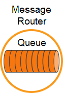

This tutorial builds on the basic concepts introduced in the [publish/subscribe tutorial](../publish-subscribe/), and will show you how to send and receive persistent messages from a Solace queue in a point to point fashion.

## Assumptions

This tutorial assumes the following:

*   You are familiar with Solace PubSub+ [core concepts](https://docs.solace.com/PubSub-Basics/Core-Concepts.htm).
*   You have access to Solace messaging with the following configuration details:
    *   Connectivity information for a Solace message-VPN configured for guaranteed messaging support
    *   Enabled client username and password
    *   Client-profile enabled with guaranteed messaging permissions.

One simple way to get access to Solace messaging quickly is to create a messaging service in Solace Cloud [as outlined here](https://solace.com/products/event-broker/cloud/). You can find other ways to get access to Solace messaging below.

## Goals

The goal of this tutorial is to understand the following:

*   How to programmatically create a durable queue on the PubSub+ 
*   How to send a persistent message to a Solace queue
*   How to bind to this queue and receive a persistent message

`markdown:solaceMessaging-part1.md`

`markdown:solaceMessaging-part2.md`
`markdown:solaceApi.md`
`markdown:initC.md`

## Provisioning a Queue through the API



The first requirement for guaranteed messaging using a Solace message router is to provision a guaranteed message endpoint. For this tutorial we will use a point-to-point queue. To learn more about different guaranteed message endpoints see [here](https://docs.solace.com/PubSub-Basics/Endpoints.htm).

Durable endpoints are not auto created on Solace message routers. However there are two ways to provision them.

*   Using the management interface
*   Using the APIs

Using the Solace Messaging APIs to provision an endpoint can be a convenient way of getting started quickly without needing to become familiar with the management interface. This is why it is used in this tutorial. However it should be noted that the management interface provides more options to control the queue properties. So generally it becomes the preferred method over time.

Provisioning an endpoint through the API requires the “Guaranteed Endpoint Create” permission in the client-profile. You can confirm this is enabled by looking at the client profile in Broker Manager. If it is correctly set you will see the following:


Provisioning the queue involves three steps.

1. Check if end point provisioning is supported.
   
   ```cpp
    /* Check if the endpoint provisioning is support */
    if ( !solClient_session_isCapable ( session_p, SOLCLIENT_SESSION_CAPABILITY_ENDPOINT_MANAGEMENT ) ) {

        printf ( "Endpoint management not supported on this appliance.\n" );
        return -1;
    }

   ```
2. Set the properties for your queue. This example sets the permission and the quota of the endpoint. More detail on the possible settings can be found in [developer documentation](https://docs.solace.com/API-Developer-Online-Ref-Documentation/c/index.html).
   ```cpp
    /* Provision Properties */
    const char     *provProps[20] = {0, };
    int             provIndex;

    /* Configure the Provision properties */
    provIndex = 0;

    provProps[provIndex++] = SOLCLIENT_ENDPOINT_PROP_ID;
    provProps[provIndex++] = SOLCLIENT_ENDPOINT_PROP_QUEUE;

    provProps[provIndex++] = SOLCLIENT_ENDPOINT_PROP_NAME;
    provProps[provIndex++] = argv[5];

    provProps[provIndex++] = SOLCLIENT_ENDPOINT_PROP_PERMISSION;
    provProps[provIndex++] = SOLCLIENT_ENDPOINT_PERM_DELETE;

    provProps[provIndex++] = SOLCLIENT_ENDPOINT_PROP_QUOTA_MB;
    provProps[provIndex++] = "100";
   ```
3. Proceed to provision the queue.

```cpp
    /* Queue Network Name to be used with "solClient_session_endpointProvision()" */
    char            qNN[80];

    /* Try to provision the Queue. Ignore if already exists */
    solClient_session_endpointProvision ( ( char ** ) provProps,
                                          session_p,
                                          SOLCLIENT_PROVISION_FLAGS_WAITFORCONFIRM|
                                          SOLCLIENT_PROVISION_FLAGS_IGNORE_EXIST_ERRORS,
                                          NULL, qNN, sizeof ( qNN ) );
```

## Sending a message to a queue

Now it is time to send a message to the queue.


To send a message, you must create a message and a queue destination. This tutorial will send a PubSub+ binary message with contents "Hello world!". Then you must send the message to the Solace Event Broker.


```cpp
     /* Message */
    solClient_opaqueMsg_pt msg_p = NULL;
    solClient_destination_t destination;
    const char *text_p = "Hello world!";
   
    /* Allocate a message. */
    solClient_msg_alloc ( &msg_p );

    /* Set the delivery mode for the message. */
    solClient_msg_setDeliveryMode ( msg_p, SOLCLIENT_DELIVERY_MODE_PERSISTENT );

    /* Set the destination. */
    destination.destType = SOLCLIENT_QUEUE_DESTINATION;
    destination.dest = argv[5];
    solClient_msg_setDestination ( msg_p, &destination, sizeof ( destination ) );

    /* Add some content to the message. */
    solClient_msg_setBinaryAttachment ( msg_p, text_p, ( solClient_uint32_t ) strlen ( (char *)text_p ) );

    /* Send the message. */
    printf ( "About to send message '%s' to queue '%s'...\n", (char *)text_p, argv[5] );
    solClient_session_sendMsg ( session_p, msg_p );
    printf ( "Message sent.\n" );

    /* Free the message. */
    solClient_msg_free ( &msg_p );

```

The message is transferred to the Solace Event Broker asynchronously, but if all goes well, it will be waiting for your consumer on the queue. 

## Receiving a message from a queue

Now it is time to receive the messages sent to your queue.


You still need to connect a session just as you did with the publisher. With a connected session, you then need to bind to the Solace Event Broker queue with a flow receiver. Flow receivers allow applications to receive messages from a PubSub+ guaranteed message flow. Flows encapsulate all of the acknowledgement behaviour required for guaranteed messaging. Conveniently flow receivers have the same interface as message consumers but flows also require some additional properties on creation.

A flow requires properties. At its most basic, the flow properties require the endpoint (our newly provisioned or existing queue) and an ack mode. In this example you’ll use the client ack mode where the application will explicitly acknowledge each message.

Flows are created from Solace session objects just as direct message consumers are.

Notice `flowMessageReceiveCallback` and `flowEventCallback` callbacks that are passed in when creating a flow. These callbacks will be invoked when a message arrives to the endpoint (the queue) or a flow events occurs.

You must start your flow so it can begin receiving messages.

```cpp

void
sessionEventCallback ( solClient_opaqueSession_pt opaqueSession_p,
                solClient_session_eventCallbackInfo_pt eventInfo_p, void *user_p )
{
}

static void
flowEventCallback ( solClient_opaqueFlow_pt opaqueFlow_p, solClient_flow_eventCallbackInfo_pt eventInfo_p, void *user_p )
{
}

/*************************************************************************
 * Create a Flow
*************************************************************************/
/* Flow Properties */
const char     *flowProps[20] = {0, };

/* Flow */
solClient_opaqueFlow_pt flow_p;
solClient_flow_createFuncInfo_t flowFuncInfo = SOLCLIENT_FLOW_CREATEFUNC_INITIALIZER;

/* Configure the Flow function information */
flowFuncInfo.rxMsgInfo.callback_p = flowMessageReceiveCallback;
flowFuncInfo.eventInfo.callback_p = flowEventCallback;

/* Configure the Flow properties */
propIndex = 0;

flowProps[propIndex++] = SOLCLIENT_FLOW_PROP_BIND_BLOCKING;
flowProps[propIndex++] = SOLCLIENT_PROP_DISABLE_VAL;

flowProps[propIndex++] = SOLCLIENT_FLOW_PROP_BIND_ENTITY_ID;
flowProps[propIndex++] = SOLCLIENT_FLOW_PROP_BIND_ENTITY_QUEUE;

flowProps[propIndex++] = SOLCLIENT_FLOW_PROP_ACKMODE;
flowProps[propIndex++] = SOLCLIENT_FLOW_PROP_ACKMODE_CLIENT;

flowProps[propIndex++] = SOLCLIENT_FLOW_PROP_BIND_NAME;
flowProps[propIndex++] = argv[5];

solClient_session_createFlow ( ( char ** ) flowProps,
                                session_p,
                                &flow_p, &flowFuncInfo, sizeof ( flowFuncInfo ) );
```

Both flow properties and endpoint properties are explained in more detail in the [developer documentation](https://docs.solace.com/API-Developer-Online-Ref-Documentation/c/index.html).

Same as direct messaging, all messages will be received thru the invocation of `sessionEventCallback`.

## Summarizing

Combining the example source code shown above results in the following source code files:

* [QueuePublisher.c](https://github.com/SolaceSamples/solace-samples-c/blob/master/src/intro/QueuePublisher.c)
* [QueueSubscriber.c](https://github.com/SolaceSamples/solace-samples-c/blob/master/src/intro/QueueSubscriber.c)

## Building

`markdown:building.md`

### Running the Samples

If you start the `QueuePublisher` with the required arguments of your Solace messaging, if will publish the message to the specified queue. In the example below, a message is published to a queue `q1`
```sh
bin$ . /setenv.sh
bin$ ./QueuePublisher <msg_backbone_ip:port> <message-vpn> <client-username> <password> <queue>
QueuePublisher initializing...
Connected.
About to send message 'Hello world!' to queue 'q1'...
Message sent.
Acknowledgement received!
Exiting.
```

You can next start the `QueueSubscriber` with the same queue `q1` and if the message has been successfully delivered and queued, the queued message will be consumed and printed out.

```sh
bin$ ./QueueSubscriber <msg_backbone_ip:port> <message-vpn> <client-username> <password> <queue>
Connected.
Waiting for messages......
Received message:
Destination:                            Queue 'q1'
Class Of Service:                       COS_1
DeliveryMode:                           PERSISTENT
Message Id:                             1
Binary Attachment:                      len=12
  48 65 6c 6c 6f 20 77 6f  72 6c 64 21                  Hello wo   rld!

Acknowledging message Id: 1.
Exiting.
```
You can also run `QueuePublisher` a few more times to let the queue to build up a little before running `QueueSubscriber`. The `QueueSubscriber` will consume all queued messages and display them. 

You have now successfully connected a client, sent persistent messages to a queue and received and acknowledged them.
