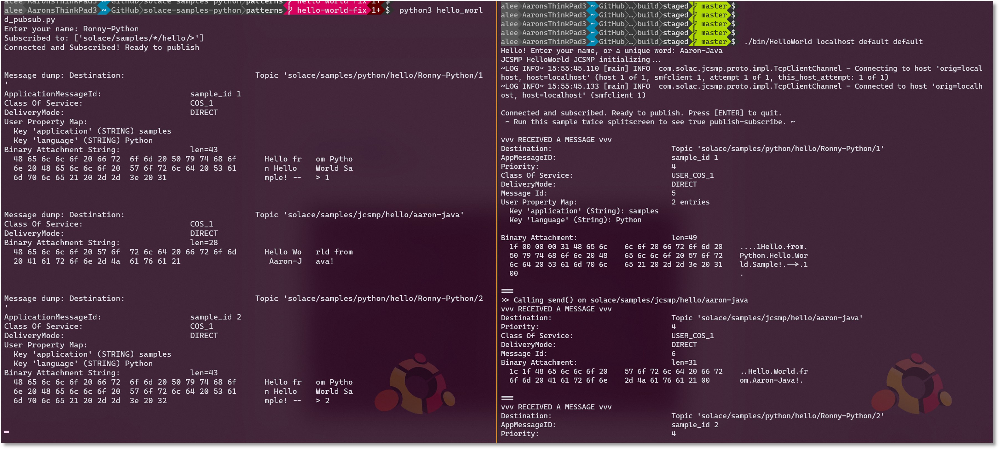

## Your first Solace app

Hello and welcome to your first Solace app tutorial.  Appropriately, we'll be looking at the sample called "HelloWorld".  At first glance, this application might seem longer than the first Java/Python/etc. program you might have ever written.  E.g.:

```java
public static void main(String... args) {
    System.out.println("Hello world!");
}
```

However, as you can tell from this [Wikipedia article](https://en.wikipedia.org/wiki/%22Hello,_World!%22_program), there are many different types of "Hello World" programs.  Rather than trying to do the bare minimum to produce some visual output, this Solace Hello World will demonstrate some very fundamental and basic features of Solace APIs and pub/sub messaging, and teach some best practices:

 - **Publish _and_ Subscribe:** most Solace applications do both
 - **Dynamic topics:** topics are hierarchical and descriptive, not static
 - **Wildcard subscriptions:** attract multiple topics via a single subscription
 - **Asynchronous messaging:** use of callback handlers
 - **Connection lifecycle management:** connect once, and stay online for the lifetime of the app

This Hello World sample application will connect to a Solace PubSub+ Event Broker, and publish/subscribe in a loop.  Let's begin!


[//]: # (`markdown:pubSubIntro.md`)

`markdown:assumption.md`

[//]: # (`markdown:smf-java.md`)

[//]: # (`markdown:pubSubGoal.md`)

`markdown:solaceMessaging-part1.md`


`markdown:solaceMessaging-part2.md`


## Source Code

The [full source code for this sample](https://github.com/SolaceSamples/solace-samples-go/blob/main/patterns/hello_world.go) is available in the [SolaceSamples GitHub repo](https://github.com/SolaceSamples/solace-samples-go).

Details on how to clone, build, and run the samples are all on GitHub.


## 1. Command line arguments
The first couple lines of the program simply read connection parameters from the console:

`embed:Go-Samples/patterns/hello_world.go#L33-39`

Specifically, for Solace Native (SMF) APIs, we need to know:

 - Broker / host IP address or hostname
    - E.g. `localhost`, `192.168.42.35`, `mr-abc123.messaging.solace.cloud`
 - Message VPN: a virtual partition of a single broker, how Solace supports multitenancy
    - E.g. `default`, `lab-vpn`, `cloud-demo-singapore`
 - Username
    - E.g. `default`, `testuser`, `solace-cloud-client`
 - Password (optional)
    - This is for basic authentication, and would be different if using certificates or single-sign-on


## 2. Enter your name

This part is certainly not required in production applications, but allows Hello World to easily build a dynamic topic based on this input. It is also useful if running multiple instances of this application, to see them "talking" to each other, as we'll see later.

`embed:Go-Samples/patterns/hello_world.go#L87-89`


## 3. Connect to the Broker

The next few lines of Hello World initialize the connection parameters, as well as a few other properties that might be useful, and connects to the broker.

`embed:Go-Samples/patterns/hello_world.go#L41-50`

(CLASSIC): The additional property "reapply subscriptions" is very useful for applications using *Direct* messaging (e.g. at-most-once delivery): it tells the API that following a reconnection to a broker (either due to network flap or broker failover), the API should automatically resubscribe any previously added Direct subscriptions; by default, this set to false and the application would be responsible.

(NEXTGEN): blank **NOTE** the sample actually has the reapply subs still in there, but it is the default now!


## 4. Setup Producer

The "producer" or publisher in Solace APIs is the component that sends messages to the Solace broker.  The producer can be configured to send both Direct and Guaranteed messages on the same session, as well as transactions and other qualities-of-service.

`embed:Go-Samples/patterns/hello_world.go#L54-63`

The producer configuration options varies from API to API.  For example, in JCSMP, you specify two callback handlers: these are mostly used for Guaranteed messaging applications, which we'll see later.  As our Hello World app uses only Direct messaging, these are not as useful, but still need to be configured regardless.  In Python or the PubSub+ Messaging API for Java, Direct publishers do not have to configure this.

(CLASSIC) callback handlers

(NEXTGEN) backpressure strategy


## 5. Set Up Consumer

The next part of the sample sets up the ability to receive messages from the broker asynchronously - that is: the application does not have to poll the broker for the next message. 

`embed:Go-Samples/patterns/hello_world.go#L67-79`
`embed:Go-Samples/patterns/hello_world.go#L16-19`

As you can see, the "on receive" or "on message" callback does not do very much in this simple application, it simply outputs the message to the screen, and continues.


## 6. Add Direct message subscriptions

To receive messages from the broker, you have to tell it what you want to receive.  To receive messages via Direct messaging, you add a (topic) subscription:

`embed:Go-Samples/patterns/hello_world.go#L69-69`

Notice a few things:
 - The topic subscription is hierarchical: there are "`/`" characters between levels
 - The use of "`*`" and "`>`" wildcard characters in the subscription
 - Direct subscription (not using Guaranteed delivery yet)

These wildcards are called single-level and multi-level wildcards respectively.  The "`*`" will match anything up to the next `/`, including the empty-string; for the multi-level, as long as the message's first part of the topic matches the subscription to that point, the "`>`" wildcard will match any remaining (one-or-more) levels.  See here for more details on [topics](https://docs.solace.com/Get-Started/what-are-topics.htm) and on [wildcards](https://docs.solace.com/Messaging/Wildcard-Charaters-Topic-Subs.htm).

So, our Hello World app is adding a subscription: `solace/samples/*/hello/>`

After adding the only one subscription (you can add as many as you'd like, within the limits of the broker), start the Consumer object which tells the broker the API is ready to start to receive messages.


## 7. Publish and receive messages

Now we are ready to send some messages, and the subscription will allow us to receive those messages back.  So in a loop, wait for some user input, and publish a message every 5 seconds:

`embed:Go-Samples/patterns/hello_world.go#L93-115`

Note that we specify the payload each loop (could be a text `String`, or a binary `byte[]` payload, etc.), as well as define what the message's published topic is.  Recall: topics are not configured in the Solace broker, they are metadata of the message, and a _pattern matching_ (via subscriptions) is done on each received message.


## 8. Run it again!

Running this application once by itself is ok to ensure you have broker connectivity, but event-driven technologies like Solace are all about decoupled distributed architectures: you need multiple applications to communicate asynchronously.  So split your terminal, or get a second screen, and try running it again.

Note that you could run a different language for your 2nd instance, or even another protocol that Solace supports (e.g. REST, MQTT, AMQP 1.0).  Just ensure your topics match the subscriptions.


 
Here is the Python HelloWorld app talking to the Java JCSMP HelloWorld app.  Both are subscribed using wildcards, one subscription each, and they will match topics published by other API flavours: note the published topic for each is different (more for demonstration purposes than anything).


## 9. What's Next?
Got a handle on how a basic Solace native app sends and receives messages?  Wondering what the next step is?
 - Higher performance publish-subscribe using Direct messages
 - Message payload transformation using Processor pattern
 - Request-Reply using blocking call (not everything needs to be asynchronous)
 - Guaranteed messaging publish-subscribe


