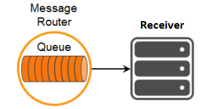

This tutorial builds on the basic concepts introduced in the [publish/subscribe tutorial](../publish-subscribe/), and will show you how to send and receive persistent messages with Apache Qpid JMS 2.0 API client using AMQP and Solace messaging.

At the end, this tutorial walks through downloading and running the sample from source.

This tutorial focuses on using a non-Solace JMS API implementation. For using the Solace JMS API see [Solace Getting Started JMS Tutorials](../../solace-samples-jms/).

## Assumptions

This tutorial assumes the following:

* You are familiar with Solace [core concepts](https://docs.solace.com/PubSub-Basics/Core-Concepts.htm).
* You have access to Solace messaging with the following configuration details:
    * Connectivity information for a Solace message-VPN configured for guaranteed messaging support
    * Enabled client username and password
    * Client-profile enabled with guaranteed messaging permissions.

One simple way to get access to Solace messaging quickly is to create a messaging service in Solace Cloud [as outlined here](https://solace.com/cloud/). You can find other ways to get access to Solace messaging below.

## Goals

The goal of this tutorial is to demonstrate how to use Apache Qpid JMS 2.0 API over AMQP using Solace messaging. This tutorial will show you:

1.  How to send a persistent message to a durable queue using Solace messaging
2.  How to bind to this queue and receive a persistent message

`markdown:solaceMessaging-part1.md`

`markdown:solaceMessaging-part2.md`
`markdown:jmsApi.md`

## Java Messaging Service (JMS) Introduction

JMS is a standard API for sending and receiving messages. As such, in addition to information provided on the Solace developer portal, you may also look at some external sources for more details about JMS. The following are good places to start

1. [https://docs.oracle.com/javaee/7/api/javax/jms/package-summary.html](https://docs.oracle.com/javaee/7/api/javax/jms/package-summary.html)
2. [https://en.wikipedia.org/wiki/Java_Message_Service](https://en.wikipedia.org/wiki/Java_Message_Service)
3. [https://docs.oracle.com/javaee/7/tutorial/partmessaging.htm#GFIRP3](https://docs.oracle.com/javaee/7/tutorial/partmessaging.htm#GFIRP3)

The last (Oracle docs) link points you to the JEE official tutorials which provide a good introduction to JMS.

This tutorial focuses on using [JMS 2.0 (May 21, 2013)](https://download.oracle.com/otndocs/jcp/jms-2_0-fr-spec/), for [JMS 1.1 (April 12, 2002)](https://download.oracle.com/otndocs/jcp/7195-jms-1.1-fr-spec-oth-JSpec/) see [Solace Getting Started AMQP JMS 1.1 Tutorials](https://docs.solace.com/Configuring-and-Managing/AMQP-Tasks/Managing-AMQP-Messaging.htm).

## Connecting to the Solace Messaging

In order to send or receive messages, an application must start a JMS connection and a session.

There are three parameters for establishing the JMS connection: the Solace messaging host name with the AMQP service port number, the client username and the optional password.

*QueueProducer.java/QueueConsumer.java*
```java
String solaceHost = args[0];
ConnectionFactory connectionFactory = new JmsConnectionFactory(solaceUsername, solacePassword, solaceHost);
```

Notice how Apache Qpid JMS 2.0 API combines `Connection` and `Session` objects into the `JMSContext` object.

*QueueProducer.java/QueueConsumer.java*
```java
JMSContext context = connectionFactory.createContext()
```

The session created by the `JMSContext` object by default is non-transacted and uses the acknowledge mode that automatically acknowledges a client's receipt of a message.

At this point the application is connected to Solace messaging and ready to send and receive messages.

## Sending a persistent message to a queue

In order to send a message to a queue a JMS *Producer* needs to be created.


There is no difference in the actual method calls to the JMS producer when sending a JMS `persistent` message as compared to a JMS `non-persistent` message shown in the [publish/subscribe tutorial](../publish-subscribe/). The difference in the JMS `persistent` message is that Solace messaging will acknowledge the message once it is successfully stored by Solace messaging and the `Producer.send()` call will not return until it has successfully received this acknowledgement. This means that in JMS, all calls to the `Producer.send()` are blocking calls and they wait for message confirmation from Solace messaging before proceeding. This is outlined in the JMS specification and Solace JMS adheres to this requirement.

See [Configuring Queues](https://docs.solace.com/Configuring-and-Managing/Configuring-Queues.htm) for details on how to configure durable queues on Solace Message Routers with Solace CLI.

See [Management Tools](https://docs.solace.com/#Management) for other tools for configure durable queues.

The JMS 2.0 API allows the use of *method chaining* to create the producer, set the delivery mode and send the message.

*QueueProducer.java*
```java
final String QUEUE_NAME = "Q/tutorial";

Queue queue = context.createQueue(QUEUE_NAME);
TextMessage message = context.createTextMessage("Hello world Queues!");
context.createProducer().setDeliveryMode(DeliveryMode.PERSISTENT).send(queue, "Hello world Queues!");
```

## Receiving a persistent message from a queue

To receive a persistent message from a queue a JMS *Consumer* needs to be created.



The JMS 2.0 API allows the use of *method chaining* to create the consumer and receive messages sent to the subscribed queue.

*QueueConsumer.java*
```java
final String QUEUE_NAME = "Q/tutorial";

Queue queue = context.createQueue(QUEUE_NAME);
Message message = context.createConsumer(queue).receive();
```

## Summarizing

Combining the example source code shown above results in the following source code files:

* [QueueProducer.java](https://github.com/SolaceSamples/solace-samples-amqp-qpid-jms2/blob/master/src/main/java/com/solace/samples/QueueProducer.java)
* [QueueConsumber.java](https://github.com/SolaceSamples/solace-samples-amqp-qpid-jms2/blob/master/src/main/java/com/solace/samples/QueueConsumer.java)

### Getting the Source

Clone the GitHub repository containing the Solace samples.

```
git clone https://github.com/SolaceSamples/solace-samples-amqp-qpid-jms2
cd solace-samples-amqp-qpid-jms2
```

### Building

You can build and run both example files directly from Eclipse or with Gradle.

```shell-session
./gradlew assemble
```

The examples can be run as:

```shell-session
cd build/staged/bin
./queueConsumer amqp://<HOST:AMQP_PORT> <USERNAME> <PASSWORD>
./queueProducer amqp://<HOST:AMQP_PORT> <USERNAME> <PASSWORD>
```

### Sample Output

First start the `QueueConsumer` so that it is up and waiting for messages.

```shell-session
$ queueConsumer amqp://<HOST:AMQP_PORT> <USERNAME> <PASSWORD>
QueueConsumer is connecting to Solace router amqp://<HOST:AMQP_PORT>...
Connected with username 'clientUsername'.
Awaiting message...
```

Then you can start the `QueueProducer` to send the message.

```shell-session
$ queueProducer amqp://<HOST:AMQP_PORT> <USERNAME> <PASSWORD>
QueueProducer is connecting to Solace router amqp://<HOST:AMQP_PORT>...
Connected with username 'clientUsername'.
Sending message 'Hello world Queues!' to queue 'Q/tutorial'...
Sent successfully. Exiting...
```

Notice how the message is received by the `QueueReceiver`.

```shell-session
Awaiting message...
TextMessage received: 'Hello world Queues!'
Message Content:
JmsTextMessage { org.apache.qpid.jms.provider.amqp.message.AmqpJmsTextMessageFacade@be64738 }
```

Now you know how to use Apache Qpid JMS 2.0 API over AMQP using Solace messaging to send and receive persistent messages from a queue.