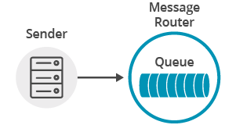

This tutorial will show you to how to connect a Apache Qpid JMS 2.0 API client to Solace Messaging using AMQP, add a topic subscription and publish a message matching this topic subscription. This is the publish/subscribe message exchange pattern as illustrated here:

At the end, this tutorial walks through downloading and running the sample from source.

This tutorial focuses on using a non-Solace JMS API implementation. For using the Solace JMS API see [Solace Getting Started JMS Tutorials](../../solace-samples-jms/).

## Assumptions

This tutorial assumes the following:

*   You are familiar with Solace [core concepts](https://docs.solace.com/PubSub-Basics/Core-Concepts.htm).
*   You have access to Solace messaging with the following configuration details:
    *   Connectivity information for a Solace message-VPN
    *   Enabled client username and password

One simple way to get access to Solace messaging quickly is to create a messaging service in Solace Cloud [as outlined here](https://solace.com/products/platform/cloud/). You can find other ways to get access to Solace messaging below.

## Goals

The goal of this tutorial is to demonstrate how to use Apache Qpid JMS 2.0 API over AMQP using Solace messaging. This tutorial will show you:

1. How to build and send a message on a topic
2. How to subscribe to a topic and receive a message

`markdown:solaceMessaging-part1.md`

`markdown:solaceMessaging-part2.md`
`markdown:jmsApi.md`

## Java Messaging Service (JMS) Introduction

JMS is a standard API for sending and receiving messages. As such, in addition to information provided on the Solace developer portal, you may also look at some external sources for more details about JMS. The following are good places to start

1. [https://docs.oracle.com/javaee/7/api/javax/jms/package-summary.html](https://docs.oracle.com/javaee/7/api/javax/jms/package-summary.html)
2. [https://en.wikipedia.org/wiki/Java_Message_Service](https://en.wikipedia.org/wiki/Java_Message_Service)
3. [https://docs.oracle.com/javaee/7/tutorial/partmessaging.htm#GFIRP3](https://docs.oracle.com/javaee/7/tutorial/partmessaging.htm#GFIRP3)

The last (Oracle docs) link points you to the JEE official tutorials which provide a good introduction to JMS.

This tutorial focuses on using [JMS 2.0 (May 21, 2013)](https://download.oracle.com/otndocs/jcp/jms-2_0-fr-spec/), for [JMS 1.1 (April 12, 2002)](https://download.oracle.com/otndocs/jcp/7195-jms-1.1-fr-spec-oth-JSpec/) see [Solace Getting Started AMQP JMS 1.1 Tutorials](https://docs.solace.com/Configuring-and-Managing/AMQP-Tasks/Managing-AMQP-Messaging.htm).

## Connecting to the Solace Messaging

In order to send or receive messages, an application must start a JMS connection and a session.

There are three parameters for establishing the JMS connection: the Solace messaging host name with the AMQP service port number, the client username and the optional password.

*TopicPublisher.java/TopicSubscriber.java*
```java
String solaceHost = args[0];
ConnectionFactory connectionFactory = new JmsConnectionFactory(solaceUsername, solacePassword, solaceHost);
```

Notice how Apache Qpid JMS 2.0 API combines `Connection` and `Session` objects into the `JMSContext` object.

*TopicPublisher.java/TopicSubscriber.java*
```java
JMSContext context = connectionFactory.createContext()
```

The session created by the `JMSContext` object by default is non-transacted and uses the acknowledge mode that automatically acknowledges a client's receipt of a message.

At this point the application is connected to Solace messaging and ready to publish messages.

## Publishing messages

A JMS *Producer* needs to be created in order to publish a message to a topic.



The JMS 2.0 API allows the use of *method chaining* to create the producer, set the delivery mode and publish the message. We assign its delivery mode to `non-persistent` for better performance.

*TopicPublisher.java*
```java
final String TOPIC_NAME = "T/GettingStarted/pubsub";

Topic topic = context.createTopic(TOPIC_NAME);
TextMessage message = context.createTextMessage("Hello world!");
context.createProducer().setDeliveryMode(DeliveryMode.NON_PERSISTENT).send(topic, message);
```

If you execute the `TopicPublisher.java` program, it will successfully publish a message, but another application is required to receive the message.

## Receiving messages

To receive a message from a topic a JMS *Consumer* needs to be created.


The JMS 2.0 API allows the use of *method chaining* to create the consumer, and receive messages published to the subscribed topic.

*TopicSubscriber.java*
```java
final String TOPIC_NAME = "T/GettingStarted/pubsub";

Topic topic = context.createTopic(TOPIC_NAME);
String message = context.createConsumer(topic).receiveBody(String.class);
```

If you execute the `TopicSubscriber.java` program, it will block at the `receiveBody(String.class)` call until a message is received. Now, if you execute the `TopicPublisher.java` that publishes a message, the `TopicSubscriber.java` program will resume and print out the received message.

## Summarizing

Combining the example source code shown above results in the following source code files:

* [TopicPublisher.java](https://github.com/SolaceSamples/solace-samples-amqp-qpid-jms2/blob/master/src/main/java/com/solace/samples/TopicPublisher.java)
* [TopicSubscriber.java](https://github.com/SolaceSamples/solace-samples-amqp-qpid-jms2//blob/master/src/main/java/com/solace/samples/TopicSubscriber.java)


### Getting the Source

Clone the GitHub repository containing the Solace samples.

```
git clone https://github.com/SolaceSamples/solace-samples-amqp-qpid-jms2
cd solace-samples-amqp-qpid-jms2
```

### Building

You can build and run both example files directly from Eclipse or with Gradle.

```shell-session
./gradlew assemble
```

The examples can be run as:

```shell-session
cd build/staged/bin
./topicSubscriber amqp://<HOST:AMQP_PORT> <USERNAME> <PASSWORD>
./topicPublisher amqp://<HOST:AMQP_PORT> <USERNAME> <PASSWORD>
```

### Sample Output

First, start `TopicSubscriber` so that it is up and waiting for published messages. You can start multiple instances of this application, and all of them will receive published messages.

```shell-session
$ topicSubscriber amqp://<HOST:AMQP_PORT> <USERNAME> <PASSWORD>
TopicSubscriber is connecting to Solace router amqp://<HOST:AMQP_PORT>...
Connected to the Solace router with client username 'clientUsername'.
Awaiting message...
```

Then you can start `TopicPublisher` to publish a message.
```shell-session
$ topicPublisher amqp://<HOST:AMQP_PORT> <USERNAME> <PASSWORD>
TopicPublisher is connecting to Solace router amqp://<HOST:AMQP_PORT>…
Sending message 'Hello world!' to topic 'T/GettingStarted/pubsub'...
Sent successfully. Exiting...
```

Notice how the published message is received by the `TopicSubscriber`.

```shell-session
Awaiting message...
Message received: 'Hello world!'
```

You now know how to use Apache Qpid JMS 2.0 API over AMQP using Solace messaging to implement the publish/subscribe message exchange pattern.