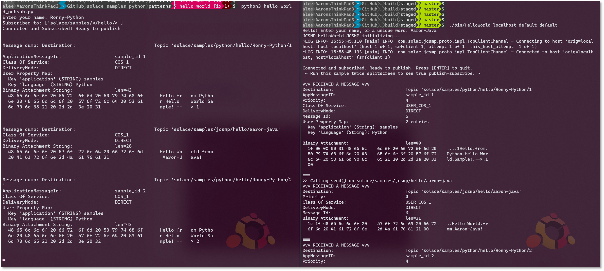

`markdown:helloWorld-intro.md`

`markdown:assumption.md`

`markdown:solaceMessaging-part1.md`

`markdown:solaceMessaging-part2.md`

## Source Code

The [full source code for this sample](https://github.com/SolaceSamples/solace-samples-java/blob/master/src/main/java/com/solace/samples/java/HelloWorld.java) is available in the [SolaceSamples GitHub repo](https://github.com/SolaceSamples/solace-samples-java).

Details on how to clone, build, and run the samples are all in the README.md file in the repo.

## 1. Command line arguments
The first couple lines of the program simply read connection parameters from the console:

`embed:Java-Samples/src/main/java/com/solace/samples/java/HelloWorld.java#L47-53`

Specifically, for Solace Native (SMF) APIs, we need to know:

 - Broker / host IP address or hostname
    - E.g. `localhost`, `192.168.42.35`, `mr-abc123.messaging.solace.cloud`
 - Message VPN: a virtual partition of a single broker, how Solace supports multitenancy
    - E.g. `default`, `lab-vpn`, `cloud-demo-singapore`
 - Username
    - E.g. `default`, `testuser`, `solace-cloud-client`
 - Password (optional)
    - This is for basic authentication, and would be different if using certificates or single-sign-on

## 2. Enter your name

This part is certainly not required in production applications, but allows Hello World to easily build a dynamic topic based on this input. It is also useful if running multiple instances of this application, to see them "talking" to each other, as we'll see later.

`embed:Java-Samples/src/main/java/com/solace/samples/java/HelloWorld.java#L54-60`

## 3. Connect to the Broker

The next few lines of Hello World initialize the connection parameters, as well as a few other properties that might be useful, and connects to the broker.

`embed:Java-Samples/src/main/java/com/solace/samples/java/HelloWorld.java#L63-74`

## 4. Setup Producer

The "producer" or publisher in Solace APIs is the component that sends messages to the Solace broker.  The producer can be configured to send both Direct and Guaranteed messages on the same session, as well as transactions and other qualities-of-service.

`embed:Java-Samples/src/main/java/com/solace/samples/java/HelloWorld.java#L75-77`

The producer configuration options varies from API to API.  For example, in JCSMP, you specify two callback handlers: these are mostly used for Guaranteed messaging applications, which we'll see later.  As our Hello World app uses only Direct messaging, these are not as useful, but still need to be configured regardless.  In Python or the PubSub+ Messaging API for Java, Direct publishers do not have to configure this.

## 5. Set Up Consumer

The next part of the sample sets up the ability to receive messages from the broker asynchronously - that is: the application does not have to poll the broker for the next message. 

`embed:Java-Samples/src/main/java/com/solace/samples/java/HelloWorld.java#L79-85`

As you can see, the "on receive" or "on message" callback does not do very much in this simple application, it simply outputs the message to the screen, and continues.

## 6. Add Direct message subscriptions

To receive messages from the broker, you have to tell it what you want to receive.  To receive messages via Direct messaging, you add a (topic) subscription:

`embed:Java-Samples/src/main/java/com/solace/samples/java/HelloWorld.java#L79-85`
`markdown:helloWorld-wildcards.md`

## 7. Publish and receive messages

Now we are ready to send some messages, and the subscription will allow us to receive those messages back.  So in a loop, wait for some user input, and publish a message every 5 seconds:

`embed:Java-Samples/src/main/java/com/solace/samples/java/HelloWorld.java#L90-106`

Note that we specify the payload each loop (could be a text `String`, or a binary `byte[]` payload, etc.), as well as define what the message's published topic is.  Recall: topics are not configured in the Solace broker, they are metadata of the message, and a _pattern matching_ (via subscriptions) is done on each received message.

## 8. Run it again!

Running this application once by itself is ok to ensure you have broker connectivity, but event-driven technologies like Solace are all about decoupled distributed architectures: you need multiple applications to communicate asynchronously.  So split your terminal, or get a second screen, and try running it again.

Note that you could run a different language for your 2nd instance, or even another protocol that Solace supports (e.g. REST, MQTT, AMQP 1.0).  Just ensure your topics match the subscriptions.

Here is the Python HelloWorld app talking to the Java JCSMP HelloWorld app.  Both are subscribed using wildcards, one subscription each, and they will match topics published by other API flavours: note the published topic for each is different (more for demonstration purposes than anything).

## 9. What's Next?
Got a handle on how a basic Solace native app sends and receives messages?  Wondering what the next step is?
 - Higher performance publish-subscribe using Direct messages
 - Message payload transformation using Processor pattern
 - Request-Reply using blocking call (not everything needs to be asynchronous)
 - Guaranteed messaging publish-subscribe
