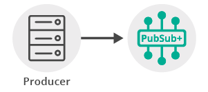

`markdown:pubSubIntro.md`

## Assumptions

This tutorial assumes the following:

*   You are familiar with Solace [core concepts](https://solace.com/samples/solace-samples-javarto/publish-subscribe/).
*   You have access to Solace messaging with the following configuration details:
    *   Connectivity information for a Solace message-VPN
    *   Enabled client username and password

One simple way to get access to Solace messaging quickly is to create a messaging service in Solace Cloud [as outlined here](https://www.solace.com/cloud/). You can find other ways to get access to Solace messaging below.

`markdown:pubSubGoal.md`

`markdown:solaceMessaging-part1.md`

`markdown:solaceMessaging-part2.md`
`markdown:solaceApi.md`

## Connecting to the Solace message router

In order to send or receive messages, an application must connect a Solace session. The Solace session is the basis for all client communication with the Solace message router.

In the Solace messaging API for JavaRTO (solclientj), a few distinct steps are required to create and connect a Solace session.

* The API must be initialized
* A Context is needed to control application threading
* Appropriate asynchronous callbacks must be declared
* The Session must be created

### Initializing the JavaRTO API

To initialize the JavaRTO API, you call the initialize method with arguments that control global configuration properties (`Solclient.GLOBAL_PROPERTIES`), or an empty String array, if there are no global properties to set.

```java
// Solclient needs to be initialized before any other API calls.
Solclient.init(new String[0]);
```
This call must be made prior to making any other calls to the JavaRTO API. It allows the API to initialize internal state and buffer pools.

### Context Creation

As outlined in the core concepts, the context object is used to control threading that drives network I/O and message delivery and acts as containers for sessions. In the JavaRTO API, application must first instantiate an object with the `ContextHandle` interface by calling `Solclient.Allocator.newContextHandle()`, then create the Context, which will be bound to the given unbound `ContextHandle`.

```java
// Context
final ContextHandle contextHandle = Solclient.Allocator.newContextHandle();
Solclient.createContextForHandle(contextHandle, new String[0]);
```

### Asynchronous Callbacks

The JavaRTO API is predominantly an asynchronous API designed for the highest speed and lowest latency. As such most events and notifications occur through callbacks. In order to get up and running, the following basic callbacks are required at a minimum.

```java
final CountDownLatch latch = new CountDownLatch(1);

// A message callback to receive messages asynchronously
MessageCallback messageCallback = new MessageCallback() {
    @Override
    public void onMessage(Handle handle) {
        try {
            // Get the received msg from the handle
            MessageSupport messageSupport = (MessageSupport) handle;
            MessageHandle rxMessage = messageSupport.getRxMessage();

            // Process the message ...

            // To display the contents of a message in human-readable form
            System.out.println(" Received message: ");
            rxMessage.dump(SolEnum.MessageDumpMode.FULL);

        } catch (SolclientException e) {
            // Handle exception
        } finally {
            latch.countDown(); // unblock main thread
        }     
    }
};

// A session event callback to events such as connect/disconnect events
SessionEventCallback sessionEventCallback = new SessionEventCallback() {
    @Override
    public void onEvent(SessionHandle sessionHandle) {
        System.out.println("Received SessionEvent:" + sessionHandle.getSessionEvent());
    }
};
```

The `messageCallback` is invoked for each Direct message received by the Session. In this sample, the message is printed to the screen. For the purpose of this tutorial a countdown latch is used to block the consumer thread until a single message has been received.

The `sessionEventCallback` is invoked for various significant session events like connection, disconnection, and other API session events. In this sample, simply prints the events. See the [JavaRTO API documentation](https://docs.solace.com/API-Developer-Online-Ref-Documentation/jrto/index.html) and samples for details on the session events.

### Session Creation

Finally a session is needed to actually connect to the Solace message router. This is accomplished by creating a properties array and connecting the session.

```java
// Configure the Session properties
ArrayList<String> sessionProperties = new ArrayList<String>();
sessionProperties.add(SessionHandle.PROPERTIES.HOST);
sessionProperties.add(host);
sessionProperties.add(SessionHandle.PROPERTIES.USERNAME);
sessionProperties.add(username);
sessionProperties.add(SessionHandle.PROPERTIES.PASSWORD);
sessionProperties.add(password);
sessionProperties.add(SessionHandle.PROPERTIES.VPN_NAME);
sessionProperties.add(vpnName);
String[] props = new String[sessionProperties.size()];

// Instantiate a new SessionHandle instance
final SessionHandle sessionHandle = Solclient.Allocator.newSessionHandle();

// Create the Session
contextHandle.createSessionForHandle(sessionHandle, sessionProperties.toArray(props), messageCallback, sessionEventCallback);

// Connect the Session
sessionHandle.connect();
```

Similar to the creating a Context, a new instance of `SessionHandle` must be created first and then allocated using the previously created `contextHandle` instance. The bounded `SessionHandle`, session properties, the message callback, and the session callback functions are passed as parameters. The final call to `SessionHandle.connect` establishes the connection to the Solace message router which makes the session ready for use.

At this point your client is connected to the Solace message router. You can use SolAdmin to view the client connection and related details.

## Receiving a message

This tutorial is uses "Direct" messages which are at most once delivery messages. So first, let's express interest in the messages by subscribing to a Solace topic. Then you can look at publishing a matching message and see it received.  


With a session connected in the previous step, then you must subscribe to a topic in order to express interest in receiving messages. This tutorial uses the topics "tutorial/topic".

```java
Topic topic = Solclient.Allocator.newTopic("tutorial/topic");
sessionHandle.subscribe(topic, SolEnum.SubscribeFlags.WAIT_FOR_CONFIRM, 0);
```

Then after the subscription is added, the consumer is started. At this point the consumer is ready to receive messages. For the purpose of this tutorial a countdown latch is used here to block the consumer thread until a single message has been received.

```java
try {
    latch.await(); // block here until message received, and latch will
                    // flip
} catch (InterruptedException e) {
    System.out.println("I was awoken while waiting");
}
```

## Sending a message

Now it is time to send a message to the waiting consumer.  



To send a message, you must create a message and a topic destination. This tutorial will send a Solace binary message with contents "Hello world!". Then you must send the message to the Solace message router.

```java
// Create a new binary message
final MessageHandle messageHandle = Solclient.Allocator.newMessageHandle();
Solclient.createMessageForHandle(messageHandle);

// Set the destination on the message
Topic topic = Solclient.Allocator.newTopic("tutorial/topic");
messageHandle.setDestination(topic);

// Create the content to publish and attach to message
String contentStr = "Hello world!";
ByteBuffer content = ByteBuffer.allocateDirect(contentStr.length());
content.put(contentStr.getBytes());
content.flip();
messageHandle.setBinaryAttachment(content);

// Send the message
sessionHandle.send(messageHandle);

// Finally free the allocated message
try {
    messageHandle.destroy();
} catch (Throwable t) {
    System.err.println("Unable to call destroy on messageCallback " + t.getCause());
}
```

In the JavaRTO API, messages are allocated and freed from an internal API message pool for greatest performance and efficiency. Therefore as shown, messages must be acquired by calls to `Solclient.createMessageForHandle` using an unbound `MessageHandle` instance, and then later freed back to the pool by calls to `MessageHandle.destroy`.

The minimum properties required to create a JavaRTO message that can be sent is to set the delivery mode, queue or topic destination, and message contents as shown in the above code. Once the message is created it is sent to the Solace message router with a call to `SessionHandle.send`.

At this point the producer has sent a message to the Solace message router and your waiting consumer will have received the message and printed its contents to the screen.

## Summarizing

The full source code for this example is available in [GitHub](https://github.com/SolaceSamples/solace-samples-javarto). If you combine the example source code shown above results in the following source:

* [TopicPublisher.java](https://github.com/SolaceSamples/solace-samples-javarto/blob/master/src/main/java/com/solace/samples/javarto/patterns/TopicPublisher.java)
* [TopicSubscriber.java](https://github.com/SolaceSamples/solace-samples-javarto/blob/master/src/main/java/com/solace/samples/TopicSubscriber.java)

### Getting the Source

This tutorial is available in GitHub.  To get started, clone the GitHub repository containing the Solace samples.

```
git clone https://github.com/SolaceSamples/solace-samples-javarto
cd solace-samples-javarto
```

### Building

Building these examples is simple. You can simply build the project using Gradle.

```
./gradlew assemble
```

This builds all of the JavaRTO Getting Started Samples with OS specific launch scripts. The files are staged in the `build/staged` directory.

### Running the Sample

Before you can run the sample, you must set the appropriate library paths for your specific runtime platform. Below instructions assume your runtime platform is Linux x86_64 and the corresponding JavaRTO API tar has been unpacked into `solclientj` subdirectory of your GitHub repository for this tutorial. For ideas on how to build on other platforms you can consult the README of the JavaRTO API library.

First, include the lib directory of the unpacked `solclientj` in your `LD_LIBRARY_PATH`:
```
export LD_LIBRARY_PATH=`pwd`/solclientj/lib:$LD_LIBRARY_PATH
```

If you start the `TopicSubscriber`, with the required arguments of your Solace messaging, it will connect and wait for a message.

```
$ ./build/staged/bin/TopicSubscriber <host:port> <client-username>@<message-vpn> <client-password>
TopicSubscriber initializing...
 Initializing the Java RTO Messaging API...
 Creating a context ...
 Creating a session ...
 Connecting session ...
 Received SessionEvent:ResponseCode [0] Info [] SessionEventEnum[0]:[UP_NOTICE] CorrelationKey [0]
 Subscribing to topic: tutorial/topic
 Subscribed. Awaiting message...
```

Then you can send a message using the `TopicPublisher` with the same arguments. If successful, the output for the producer will look like the following:

```
$ ./build/staged/bin/topicPublisher <host:port> <client-username>@<message-vpn> <client-password>
TopicPublisher initializing...
 Initializing the Java RTO Messaging API...
 Creating a context ...
 Creating a session ...
 Connecting session ...
 Received SessionEvent:ResponseCode [0] Info [] SessionEventEnum[0]:[UP_NOTICE] CorrelationKey [0]
 Creating message to publish ...
 Sending message with content: Hello world!
 Message Sent. Existing.
```

With the message delivered the subscriber output will look like the following:

```
 Received a message with content: Hello world!
 Complete message dump:
Destination:                            Topic 'tutorial/topic'
Class Of Service:                       COS_1
DeliveryMode:                           DIRECT
Binary Attachment:                      len=12
  48 65 6c 6c 6f 20 77 6f  72 6c 64 21                  Hello wo   rld!

 Existing.
```

The received message is printed to the screen. The binary message contents was “Hello world!” as expected and the message dump contains extra information about the Solace message that was received.

You have now successfully connected a client, subscribed to a topic and exchanged messages using this topic.
