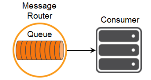

This tutorial builds on the basic concepts introduced in [Persistence with Queues](../persistence-with-queues/) tutorial and will show you how to make use of one of Solace’s advanced queueing features called “Topic to Queue Mapping.”

In addition to spooling messages published directly to the queue, it is possible to add one or more topic subscriptions to a durable queue so that messages published to those topics are also delivered to and spooled by the queue. This is a powerful feature that enables queues to participate equally in point to point and publish / subscribe messaging models. More details about the [“Topic to Queue Mapping” feature here](https://docs.solace.com/PubSub-Basics/Core-Concepts-Endpoints-Queues.htm).

The following diagram illustrates this feature.


If you have a durable queue named `Q`, it will receive messages published directly to the queue destination named `Q`. However, it is also possible to add subscriptions to this queue in the form of topics. This example adds topics `A` and `B`. Once these subscriptions are added, the queue will start receiving messages published to the topic destinations `A` and `B`. When you combine this with the wildcard support provided by Solace topics this opens up a number of interesting use cases.
## Assumptions

This tutorial assumes the following:

*   You are familiar with Solace [core concepts](https://docs.solace.com/PubSub-Basics/Core-Concepts.htm).
*   You understand the basics introduced in [Persistence with Queues](../persistence-with-queues/)
*   You have access to Solace messaging with the following configuration details:
    *   Connectivity information for a Solace message-VPN configured for guaranteed messaging support
    *   Enabled client username and password
    *   Client-profile enabled with guaranteed messaging permissions.

One simple way to get access to Solace messaging quickly is to create a messaging service in Solace Cloud [as outlined here](https://solace.com/cloud/). You can find other ways to get access to Solace messaging below.

## Goals

The goal of this tutorial is to understand the following:

1.  How to add topic subscriptions to a queue
2.  How to interrogate the Solace message broker to confirm capabilities.

`markdown:solaceMessaging-part1.md`

`markdown:solaceMessaging-part2.md`
`markdown:solaceApi.md`
`markdown:loadAndInitSolaceApi.md`

## Connecting to the Solace message broker

In order to send or receive messages, an application must connect a Solace session. The Solace session is the basis for all client communication with the Solace message broker.

The `solace.SolclientFactory` is used to create a Solace `Session` from `SessionProperties`. In the example below, `SessionProperties` is created using object initializers.

Then listeners are defined for Session Events of interest and for receiving direct messages, which are explained in the next sections.

The created session connects to the Solace message broker with the `session.connect()` call.

This tutorial’s sample code comes as two separate applications: one (with the "publisher" object) publishes messages to a specific topic, and the other (with the "subscriber" object) subscribes to messages on that topic and receives the messages.

The following is an example of a session creating and connecting to the Solace message broker for the subscriber. The publisher's code will be the same except for that it doesn't require a message event listener.

```javascript
// create session
subscriber.session = solace.SolclientFactory.createSession({
    // solace.SessionProperties
    url:      hosturl,
    vpnName:  vpn,
    userName: username,
    password: pass,
});
// define session event listeners
    /*...see section Session Events...*/
// define message event listener
    /*...see section Receiving a message...*/
// connect the session
try {
    subscriber.session.connect();
} catch (error) {
    subscriber.log(error.toString());
}
```
At this point your browser is connected as a client to the Solace message broker. You can use SolAdmin to view this client connection and related details.

## Session Events

The Solace Web Messaging API for JavaScript communicates changes in status and results of connect and subscription calls through emitting session events with certain event names.

It is necessary to wire your application logic to events through listeners to take appropriate action. The most important events are:

*   `SessionEventCode.UP_NOTICE`: success connecting session to the Solace message broker
*   `SessionEventCode.CONNECT_FAILED_ERROR`: unable to connect to the Solace message broker
*   `SessionEventCode.DISCONNECTED`: session was disconnected from the Solace message broker

This is how event listeners can be defined in the sample subscriber:

```javascript
// define session event listeners
subscriber.session.on(solace.SessionEventCode.UP_NOTICE, function (sessionEvent) {
    subscriber.log('=== Successfully connected and ready to publish messages. ===');
});
subscriber.session.on(solace.SessionEventCode.CONNECT_FAILED_ERROR, function (sessionEvent) {
    subscriber.log('Connection failed to the message broker: ' + sessionEvent.infoStr +
        ' - check correct parameter values and connectivity!');
});
subscriber.session.on(solace.SessionEventCode.DISCONNECTED, function (sessionEvent) {
    subscriber.log('Disconnected.');
    if (subscriber.session !== null) {
        subscriber.session.dispose();
        subscriber.session = null;
    }
});
```
### Receiving a message from a queue

Now it is time to receive the messages sent to your queue.



Receiving guaranteed messages is different from the direct messaging case described in the the publish/subscribe tutorial.

To receive guaranteed messages, a connected `Session` is used to create a Solace `MessageConsumer` object from `MessageConsumerProperties` and then connected, meaning that it will bind to the queue on the message broker and can start receiving messages.

```javascript
// Create message consumer
subscriber.messageSubscriber = subscriber.session.createMessageConsumer({
    // solace.MessageConsumerProperties
    queueDescriptor: { name: subscriber.queueName, type: solace.QueueType.QUEUE },
    acknowledgeMode: solace.MessageConsumerAcknowledgeMode.CLIENT, // Enabling Client ack
    createIfMissing: true // Create queue if not exists
});
// define message consumer event listeners
    /*...see section Message Consumer Events...*/
// define message received event listener
    /*...see section Message Consumer Message Received Event...*/
// connect the message consumer
try {
    subscriber.messageSubscriber.connect();
} catch (error) {
    subscriber.log(error.toString());
}
```

Notice that here we use the Solace "Client acknowledgement mode", which allows the consumers to acknowledge each message individually. You can learn more about acknowledgement modes in the [Solace Documentation – Acknowledging Messages Received by Clients](https://docs.solace.com/Solace-PubSub-Messaging-APIs/API-Developer-Guide/Acknowledging-Messages.htm).

```javascript
    acknowledgeMode: solace.MessageConsumerAcknowledgeMode.CLIENT, // Enabling Client ack
```

We also want to create the queue if it is found missing on the Broker, so we set the "createIfMissing" flag to true.

```javascript
    createIfMissing: true // Create queue if not exists
```

#### Message Consumer Events

Message consumer related events will be sent to the event listeners defined for the `MessageConsumer`. The most important events are:

*   `MessageConsumerEventName.UP`: the message consumer has successfully bound to the destination and ready to receive messages
*   `MessageConsumerEventName.CONNECT_FAILED_ERROR`: the message consumer has not been able to bind to the destination
*   `MessageConsumerEventName.DOWN`: the message consumer has been disconnected.

```javascript
// Define message consumer event listeners
subscriber.messageSubscriber.on(solace.MessageConsumerEventName.UP, function () {
    subscriber.consuming = true;
    subscriber.log('=== Ready to receive messages. ===');
});
subscriber.messageSubscriber.on(solace.MessageConsumerEventName.CONNECT_FAILED_ERROR, function () {
    subscriber.consuming = false;
    subscriber.log('=== Error: the message consumer could not bind to queue "' + subscriber.queueName +
        '" ===\n   Ensure this queue exists on the message broker');
});
subscriber.messageSubscriber.on(solace.MessageConsumerEventName.DOWN, function () {
    subscriber.consuming = false;
    subscriber.log('=== An error happened, the message consumer is down ===');
});
```

#### Adding subscriptions to the Message Consumer

We can add subscriptions to the `MessageConsumer` to attract events on a specific topic. 

```javascript
subscriber.messageSubscriber.addSubscription(
    solace.SolclientFactory.createTopicDestination(subscriber.topicName),
    subscriber.topicName, // correlation key as topic name
    10000 // 10 seconds timeout for this operation
);
```

Notice parameters to the session `addSubscription` function.

*   __The first parameter__ is the `solace.Destination` created from the topic name.
*   __The second (Object | String | null | undefined) parameter__ specifies a correlation key. If specified, this value is echoed within `MessageConsumerEvent`.
*   __The third parameter__ is the request timeout period (in milliseconds). If specified, this value overwrites `readTimeoutInMsecs` property in `SessionProperties`.


After the subscription is successfully added the subscriber is ready to receive messages and nothing happens until a message is received.

#### Message Consumer Subscription Events
Message consumer subscription related events will be sent to the event listeners defined for the `MessageConsumer`. The important events are:

*   `MessageConsumerEventName.SUBSCRIPTION_OK`: the message consumer has successfully added subscription to the queue on the message broker and will receive messages on the subscribed topic
*   `MessageConsumerEventName.SUBSCRIPTION_ERROR`: the message consumer subscription failed as the message broker rejected the queue subscription

```javascript
// Define message consumer event listeners
subscriber.messageSubscriber.on(solace.MessageConsumerEventName.SUBSCRIPTION_OK, function (sessionEvent) {
    subscriber.log('=== Ready to receive messages. ===\n' +
                    'Correlation key - ' + sessionEvent.correlationKey);
});
subscriber.messageSubscriber.on(solace.MessageConsumerEventName.SUBSCRIPTION_ERROR, function (sessionEvent) {
  subscriber.log('Cannot subscribe to topic ' + sessionEvent.reason);
});
```

#### Message Consumer Message Received Event

Message received events will be sent to the message received event listener defined for the message consumer. Successful processing of a message must be explicitly acknowledged because "client acknowledgement mode" is used:

```javascript
// Define message received event listener
subscriber.messageSubscriber.on(solace.MessageConsumerEventName.MESSAGE, function (message) {
    subscriber.log('Received message: "' + message.getBinaryAttachment() + '",' +
        ' details:\n' + message.dump());
    // Need to explicitly ack otherwise it will not be deleted from the message broker
    message.acknowledge();
});
```
## Summarizing

### Getting the Source

Clone the GitHub repository containing the Solace samples.

```
git clone https://github.com/SolaceSamples/solace-samples-javascript
cd solace-samples-javascript
```

Note: the code in the `master` branch of this repository depends on Solace JavaScript API version 10 or later. If you want to work with an older version clone the branch that corresponds your version.

### Installing the Web Messaging API for JavaScript

It is assumed that the `lib` directory containing the API libraries will be installed at the root of the cloned `solace-samples-javascript` repository:

```bash
cp -R <path_to_unzipped_API_distribution_package>/lib/ .
```

### Running the Samples

The samples consist of two separate publisher and subscriber browser applications, each comes as a pair: one HTML file and one JavaScript file that is loaded by the HTML file.

**Sample Output**

First open `src/basic-samples/GuaranteedSubscriber/GuaranteedSubscriber.html` page in the browser and connect to a Solace broker by specifying the message broker properties and clicking *Connect* button.

Then create a consumer and start consuming messages by clicking the *Consume Messages* button.

The following is a screenshot of the tutorial’s `GuaranteedSubscriber.html` web page with the JavaScript debug console open in the Firefox browser. It captures the page after it was loaded and the *Connect* button was clicked and then the *Consume Messages* button was clicked.

<br><br/><br><br/>

Now, open `src/basic-samples/GuaranteedPublisher/GuaranteedPublisher.html` page in the browser and connect to the same Solace broker by specifying the message broker properties and clicking “Connect” button.

Publish messages by clicking the Send Message” button on the _GuaranteedPublisher_/GuaranteedPublisher.html_ page.

The following screenshots of the tutorial’s `GuaranteedPublisher.html` and `GuaranteedPublisher.html` web pages with the JavaScript debug console open in the Firefox browser. It captures the pages after a message was published and received.

This is the publisher is publishing a message (`GuaranteedPublisher.html)`:

<br><br/><br><br/>

This is the subscriber receiving a message (`GuaranteedSubscriber.html)`:

<br><br/><br><br/>

With that you now know how to successfully implement topic to queue mapping using publish-subscribe message exchange pattern using Guaranteed messages.
