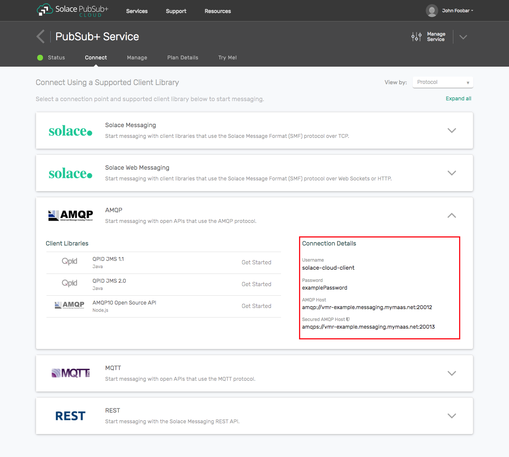

## High Performance Guaranteed Messaging apps

The next tutorial in our series of sample applications will address some basic patterns for event-driven applications: publishing (sending messages), subscribing (receiving messages), and a specific combination of the two.  The term “processor” is pulled from the Spring Framework, where it denotes a microservice that receives a message, does some processing / annotation / decoration / validation upon it, and publishes a new message as a result.

Most real-world event-driven applications and microservices employ some combination of publishing and subscribing; it is rare for an app to exclusively publish or exclusively subscribe.  For example:

- Mainly _publishing_ applications (financial market data feeds, or sensor gateways) might subscribe to health check or presence topics, or command-and-control topics
- Mainly _subscribing_ applications (database updaters, stats/metrics dashboard GUIs) might publish occasional logging information or metrics of how they are currently operating

Once we begin to look at request-reply patterns and samples, those applications by design must be able to both publish and subscribe.

**Please ensure you have reviewed the HelloWorld tutorial to start**, as this tutorial continues to build on first principles introduced there, and will introduce a few more features and concepts.  The Direct Pub and  Sub samples are intended to be more performant examples: they do not print every message to the screen or perform heavy calculations in the message callback, and should be able to run at very high message rates if the thread sleep is removed.

[//]: # (`markdown:pubSubIntro.md`)

`markdown:assumption.md`

`markdown:smf-jcsmp.md`

[//]: # (`markdown:pubSubGoal.md`)

`markdown:solaceMessaging-part1.md`

`markdown:solaceMessaging-part2.md`

## Source Code

The full source code for these samples are available in the [SolaceSamples GitHub repo](https://github.com/SolaceSamples/solace-samples-java-jcsmp):

- [GuaranteedPublisher.java](https://github.com/SolaceSamples/solace-samples-java-jcsmp/blob/master/src/main/java/com/solace/samples/jcsmp/patterns/GuaranteedPublisher.java)
- [GuaranteedProcessor.java](https://github.com/SolaceSamples/solace-samples-java-jcsmp/blob/master/src/main/java/com/solace/samples/jcsmp/patterns/GuaranteedProcessor.java)
- [GuaranteedSubscriber.java](https://github.com/SolaceSamples/solace-samples-java-jcsmp/blob/master/src/main/java/com/solace/samples/jcsmp/patterns/GuaranteedSubscriber.java)

Details on how to clone, build, and run the samples are all on GitHub.

## User Properties

In these tutorials, we'll look at setting some additional User Properties; these are carried in a section of the message outside both the header and the payload.

User Properties are exceptionally useful to provide an additional level of filtering in the Solace broker through the use of **Selectors**.  Selectors in Solace operate only on Guaranteed messages, as they are applied through a connection to a Queue Endpoint or Topic Endpoint.  Selectors are specified by consuming applications, and have a syntax similar to SQL.  Note that filtering performed using Selectors is much more computationally intensive in the broker vs. topic filtering, therefore for performance reasons Solace usually recommends and prefers the use of a detailed topic hierarchy and wildcards for filtering if possible.

