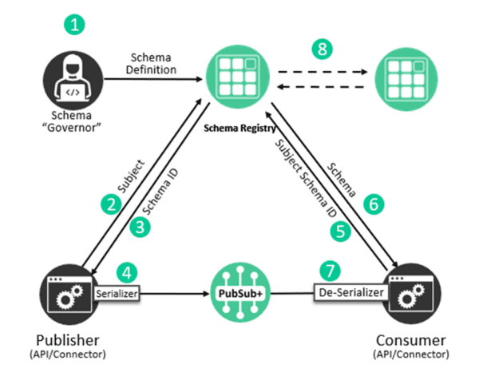

This feature exploration shows how to use the Solace Schema Registry with JSON Schema serializers and deserializers (SERDES) to automatically validate and manage event schemas when publishing and consuming events. AVRO and generic SERDES are also availble in JCSMP and work in a very similar way.  We will not explore those examples specifically in this tutorial but there are samples available in the JCSMP Samples repository. 

## Feature Overview

The Solace Schema Registry provides a centralized repository for managing message schemas, enabling schema validation, versioning, and evolution across your event-driven applications. The Schema Registry SERDES integration with JCSMP allows you to serialize and deserialize messages while automatically validating them against registered schemas.



Key benefits include:
* **Automatic Schema Validation**: Messages are validated against registered schemas during serialization and deserialization
* **Type Safety**: Serialize from and deserialize to Plain Old Java Objects (POJOs) with compile-time type checking
* **Schema Evolution**: Manage schema versions and support backward/forward compatibility
* **Centralized Management**: Store and manage schemas in a centralized registry accessible by all applications

The Schema Registry SERDES library supports both JSON Schema and Apache Avro formats. This tutorial focuses on JSON Schema serialization and deserialization, but Avro support is also available in the sample repository. For generic serialization and deserialization examples, see the complete sample code in the GitHub repository.

## Prerequisites

* A Solace PubSub+ broker (version 10.5 or later) with Schema Registry deployed
* Access to the Schema Registry with appropriate credentials
* JSON Schema files uploaded to the Schema Registry 
* There must be a suitable [Client Profile](https://docs.solace.com/Configuring-and-Managing/Configuring-Client-Profiles.htm) configured on your broker
For guidance on schema registry setup complete the [Schema registry codelab](https://codelabs.solace.dev/codelabs/schema-registry/?index=..%2F..index#0)

For more information about the Solace Schema Registry, refer to the [Schema Registry Overview](https://docs.solace.com/Schema-Registry/schema-registry-overview.htm) documentation.

NOTE: The Schema Registry SERDES library requires the following Gradle dependencies:
```gradle
implementation(platform('com.solace:solace-schema-registry-serdes-bom:1.+'))
implementation 'com.solace:solace-schema-registry-jsonschema-serde'
```

## Configuring the Schema Registry Connection

Before using the serializers and deserializers, you need to configure the connection to the Schema Registry. The configuration uses environment variables or system properties:

`embed:JCSMP-Samples/src/main/java/com/solace/samples/jcsmp/features/serdes/jsonschema/JsonSchemaSerializeProducer.java#L129-140`


## JSON Schema Serialization

To serialize messages using JSON Schema, create a `JsonSchemaSerializer` and configure it with your Schema Registry connection details. The serializer validates your Java objects against the registered schema before converting them to JSON.

### Creating and Configuring the Serializer

`embed:JCSMP-Samples/src/main/java/com/solace/samples/jcsmp/features/serdes/jsonschema/JsonSchemaSerializeProducer.java#L69-112`

If the data doesn't conform to the registered schema, a `JsonSchemaValidationException` will be thrown during serialization.

## JSON Schema Deserialization

Deserialization works in reverse - it validates incoming JSON messages against the registered schema and converts them to Java objects.

### Deserializing to JsonNode

For flexible JSON handling, you can deserialize to Jackson's `JsonNode`:

`embed:JCSMP-Samples/src/main/java/com/solace/samples/jcsmp/features/serdes/jsonschema/JsonSchemaDeserializeConsumerToJsonNode.java#L69-112`


### Deserializing to POJOs

For type-safe deserialization directly to Java objects, configure your JSON Schema with the `customJavaType` property. This allows the deserializer to automatically map JSON to your POJO:

`embed:JCSMP-Samples/src/main/java/com/solace/samples/jcsmp/features/serdes/jsonschema/JsonSchemaDeserializeConsumerToPojo.java#L72-108`

## Error Handling

When working with Schema Registry SERDES, handle these common exceptions:

* **JsonSchemaValidationException**: Thrown when data doesn't conform to the registered schema
* **RuntimeException**: May be thrown for deserialization errors or encoding issues
* **JCSMPException**: Standard JCSMP exceptions for connection and messaging issues

```java
try {
    byte[] data = serializer.serialize(topic, payload);
} catch (JsonSchemaValidationException e) {
    System.err.println("Validation error: " + e.getMessage());
    // Handle invalid data - fix schema or data
} catch (Exception e) {
    System.err.println("Serialization error: " + e.getMessage());
    // Handle other serialization issues
}
```

## Additional SERDES Support

This tutorial demonstrates JSON Schema serialization and deserialization. The Solace Schema Registry SERDES library also provides:

* **Apache Avro SERDES**: For binary serialization with Avro schemas
* **Generic Serializers/Deserializers**: For working with multiple schema formats dynamically

For complete examples of these features, see the [SERDES samples](https://github.com/SolaceSamples/solace-samples-java-jcsmp/tree/master/src/main/java/com/solace/samples/jcsmp/features/serdes) in the GitHub repository.

## Learn More

* Related Source Code: [Schema Registry JSON SERDES Samples](https://github.com/SolaceSamples/solace-samples-java-jcsmp/tree/master/src/main/java/com/solace/samples/jcsmp/features/serdes/jsonschema)
* [Solace Schema Registry Documentation](https://docs.solace.com/Schema-Registry/schema-registry-overview.htm)
* [Schema Registry SERDES GitHub Repository](https://github.com/SolaceSamples/solace-samples-java-jcsmp/tree/master/src/main/java/com/solace/samples/jcsmp/features/serdes)
