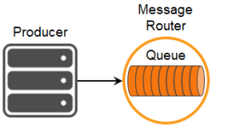

This tutorial builds on the basic concepts introduced in the [publish/subscribe tutorial](../publish-subscribe/), and will show you how to send and receive persistent messages from a Solace messaging queue in a point to point fashion.

## Assumptions

This tutorial assumes the following:

*   You are familiar with Solace [core concepts](https://docs.solace.com/PubSub-Basics/Core-Concepts.htm).
*   You have access to Solace messaging with the following configuration details:
    *   Connectivity information for a Solace message-VPN configured for guaranteed messaging support
    *   Enabled client username and password
    *   Client-profile enabled with guaranteed messaging permissions.

One simple way to get access to Solace messaging quickly is to create a messaging service in Solace Cloud [as outlined here](https://www.solace.com/cloud/). You can find other ways to get access to Solace messaging below.

## Goals

The goal of this tutorial is to understand the following:

1.  How to programmatically create a durable queue with Solace messaging
2.  How to send a persistent message to a Solace queue
3.  How to bind to this queue and receive a persistent message

## Java Messaging Service (JMS) Introduction

JMS is a standard API for sending and receiving messages. As such, in addition to information provided on the Solace developer portal, you may also look at some external sources for more details about JMS. The following are good places to start

1.  [https://docs.oracle.com/javaee/7/api/javax/jms/package-summary.html](https://docs.oracle.com/javaee/7/api/javax/jms/package-summary.html)
2.  [https://en.wikipedia.org/wiki/Java_Message_Service](https://en.wikipedia.org/wiki/Java_Message_Service)
3.  [https://docs.oracle.com/javaee/7/tutorial/partmessaging.htm#GFIRP3](https://docs.oracle.com/javaee/7/tutorial/partmessaging.htm#GFIRP3)

The oracle link points you to the JavaEE official tutorials which provide a good introduction to JMS. This getting started tutorial follows a similar path and shows you the Solace specifics that you need to do to get this working with Solace messaging.

`markdown:solaceMessaging-part1.md`

`markdown:solaceMessaging-part2.md` 
`markdown:solaceApi.md`

## JMS administered objects

This tutorial will make use of two JMS administered objects:

*   A ConnectionFactory object – Used by JMS clients to successfully connect to a message broker like Solace messaging
*   A Queue Destination – Used for publishing and subscribing to messages. This example will use the queue `Q/tutorial`

As described in the [publish/subscribe tutorial](../publish-subscribe/) we will use the approach of programmatically creating the required objects.

## Creating a durable queue with Solace Messaging

A difference to the publish/subscribe tutorial is that here a physical endpoint resource – a durable queue, associated with the Queue Destination – needs to be created on Solace messaging, which will persist the messages until consumed.

We will use the Dynamic Durables feature, which enables the physical endpoint resource to be dynamically created without any additional steps, when the JMS Queue Destination is created programmatically. It is also possible to create resources administratively on the router using the Solace message router [Management Tools](https://docs.solace.com/#Management).

To use Dynamic Durables, you need to connect the JMS Connection as outlined in the [publish/subscribe tutorial](../publish-subscribe/) with one additional property:

```java
connectionFactory.setDynamicDurables(true);
```

Then we simply create a queue from the JMS `Session`. For other ways of obtaining a queue, for example using JNDI, refer to the [Solace JMS Documentation - Working with Destinations](https://docs.solace.com/Solace-JMS-API/Working-with-Destination.htm).

```java
final String QUEUE_NAME = "Q/tutorial";
Queue queue = session.createQueue(QUEUE_NAME);
```

Because the Dynamic Durables property has been enabled when creating the connection, it will ensure that the physical queue endpoint resource will also be created dynamically if it doesn’t exist.

## Sending a message to a queue

Now it is time to send a message to the queue.



There is no difference in the actual method calls to the JMS `MessageProducer` when sending a PERSISTENT message as compared to a NON-PERSISTENT message shown in the publish/subscribe tutorial. The difference in the PERSISTENT message is that Solace messaging will acknowledge the message once it is successfully stored on the message router and the `MessageProducer.send()` call will not return until it has successfully received this acknowledgement. This means that in JMS, all calls to the `MessageProducer.send()` are blocking calls and they wait for message confirmation from Solace messaging before proceeding. This is outlined in the JMS 1.1 specification and Solace JMS adheres to this requirement.

To send a message, you must still create a message. The difference from sending a NON-PERSISTENT message is that you must set the message delivery mode to PERSISTENT on send.

```java
TextMessage message = session.createTextMessage("Hello world Queues!");
messageProducer.send(queue, message, DeliveryMode.PERSISTENT, Message.DEFAULT_PRIORITY, Message.DEFAULT_TIME_TO_LIVE);
```

At this point the producer has sent a message to Solace messaging and it will be waiting for your consumer on the queue.

## Receiving a message from a queue

Now it is time to receive the messages sent to your queue.


You still need a JMS `Connection` just as you did with the producer. With a connection, you then need to create a Session and bind to Solace messaging queue by creating a `MessageConsumer`. This is nearly identical to what was shown in the publish/subscribe tutorial. In this case, create a Session but use the Solace client acknowledgement mode. This allows the consumers to acknowledge each message individually without side-effects. You can learn more about acknowledgement modes in the Establishing Connections sections of [Solace JMS Documentation – Establishing Connections](https://docs.solace.com/Solace-JMS-API/Establishing-Connections.htm).

```java
Session session = connection.createSession(false, SupportedProperty.SOL_CLIENT_ACKNOWLEDGE));
```

Then your `MessageConsumer` can remain the same as before, only add a call to `message.acknowledge()` once you’re done processing the message.

```java
messageConsumer.setMessageListener(new MessageListener() {
    @Override
    public void onMessage(Message message) {
        try {
            if (message instanceof TextMessage) {
                System.out.printf("TextMessage received: '%s'%n", ((TextMessage) message).getText());
            } else {
                System.out.println("Message received.");
            }
            System.out.printf("Message Content:%n%s%n", message.toString());

            message.acknowledge();

            latch.countDown(); // unblock the main thread
        } catch (JMSException ex) {
            System.out.println("Error processing incoming message.");
            ex.printStackTrace();
        }
    }
});
```

## Summarizing

The full source code for this example is available in [GitHub](https://github.com/SolaceSamples/solace-samples-jms). If you combine the example source code shown above results in the following source:

* [QueueProducer.java](https://github.com/SolaceSamples/solace-samples-jms/blob/master/src/main/java/com/solace/samples/QueueProducer.java)
* [QueueConsumer.java](https://github.com/SolaceSamples/solace-samples-jms/blob/master/src/main/java/com/solace/samples/QueueConsumer.java)


### Getting the Source

Clone the GitHub repository containing the Solace samples.

```
git clone https://github.com/SolaceSamples/solace-samples-jms
cd solace-samples-jms
```

### Building

Building these examples is simple.  You can simply build the project using Gradle.

```
./gradlew assemble
```

This builds all of the JMS Getting Started Samples with OS specific launch scripts. The files are staged in the `build/staged` directory.


### Running the Sample

First start the `QueueProducer` to send a message to the queue. Then you can use the `QueueConsumer` sample to receive the messages from the queue.

```
$ ./build/staged/bin/queueProducer <host:port> <client-username>@<message-vpn> <client-password>
$ ./build/staged/bin/queueConsumer <host:port> <client-username>@<message-vpn> <client-password>
```

You have now successfully connected a client, sent persistent messages to a queue and received them from a consumer flow.