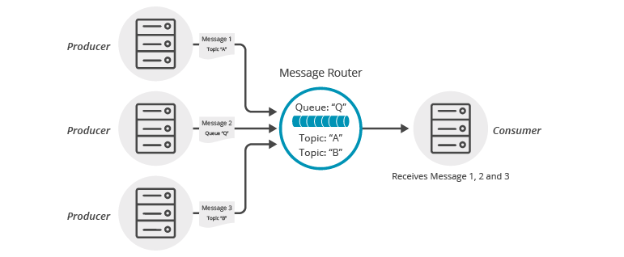

This tutorial builds on the basic concepts introduced in [Persistence with Queues](../persistence-with-queues/) tutorial and will show you how to make use of one of Solace’s advanced queueing features called “Topic to Queue Mapping”.

In addition to spooling messages published directly to the queue, it is possible to add one or more topic subscriptions to a durable queue so that messages published to those topics are also delivered to and spooled by the queue. This is a powerful feature that enables queues to participate equally in point to point and publish / subscribe messaging models. More details about the [“Topic to Queue Mapping” feature here](https://docs.solace.com/PubSub-Basics/Core-Concepts.htm).

The following diagram illustrates this feature.

If you have a durable queue named “Q”, it will receive messages published directly to the queue destination named “Q”. However, it is also possible to add subscriptions to this queue in the form of topics. This example adds topics “A” and “B”. Once these subscriptions are added, the queue will start receiving messages published to the topic destinations “A” and “B”. When you combine this with the wildcard support provided by Solace topics this opens up a number of interesting use cases.

## Topic to Queue Mapping and JMS

JMS is a standard programmatic interface with a design goal of being messaging middleware agnostic. As such, the JMS interface does not provide a way for applications to directly take advantage of the Solace Topic to Queue Mapping feature. However JMS applications wishing to take advantage of this Solace feature have a few options.

One option is to use a management interface to administratively configure the topic to queue mapping, by adding topic subscriptions to the queue. This can either be done through the CLI or SolAdmin management applications; or the SEMP programmatic management API. The SEMP API enables applications to fully configure Solace message routers. Applications can use this API by logging in to the Solace message router using a Message-VPN admin account. This concept is introduced in the [Technology – Messaging Platform Features](https://solace.com/products/tech/) and further details are available in the [Solace Message Router Product Documentation](https://docs.solace.com/SEMP/Using-Legacy-SEMP.htm).

A second option is to consider using a Solace Java API session directly for this part of your application. This is outlined in the [Java API version of this tutorial](/jcsmp/topic-to-queue-mapping/). This would involve opening a second client connection using a Java API Session and then mapping the required topics onto the desired queue. Then this Java API session can be closed.

## Summarizing

So in summary JMS applications wishing to take advantage of this feature have two options:

*   [Use one of the Solace management interfaces and directly configure the topic subscriptions on the queue](https://docs.solace.com/PubSub-Basics/Core-Concepts.htm).
*   [Use the Solace API for Java directly for this part of your application](https://solace.com/samples/solace-samples-java/topic-to-queue-mapping/).