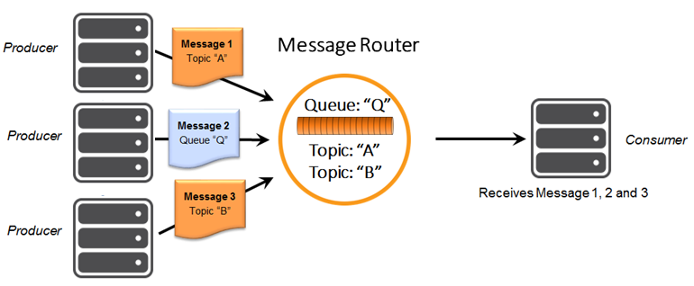

This tutorial builds on the basic concepts introduced in the [Persistence with Queues](../persistence-with-queues/) tutorial and will show you how to make use of one of Solace’s advanced queueing features called `Topic to Queue Mapping` with a Node.js API client using a Solace Message Router.

## Overview

In addition to persistent messages published directly to a durable queue, it is possible to add one or more topic subscriptions to the queue so that messages published to those topics are also delivered to and persisted by the queue. This is a powerful feature that enables queues to participate equally in point-to-point and publish/subscribe messaging models. More details about the "Topic to Queue Mapping" feature can be found [here](https://docs.solace.com/PubSub-Basics/Core-Concepts.htm).

The following diagram illustrates this feature.

If you have a durable queue named “Q”, it will receive messages published directly to the queue destination named “Q”. However, it is also possible to add subscriptions to this queue in the form of topics. This example adds topics “A” and “B”. Once these subscriptions are added, the queue will start receiving messages published to topic destinations “A” and “B”. When you combine this with wildcard support provided by Solace topics, this opens up a number of interesting use cases.

## Topic to Queue Mapping and Node.js

The Solace Node.js API does not provide a way for applications to directly take advantage of the Solace Topic to Queue Mapping feature.

However Node.js applications wishing to take advantage of this Solace feature can use a management interface to administratively configure the topic to queue mapping, by adding topic subscriptions to the queue. This can either be done through CLI or the SolAdmin management application, or by the SEMP programmatic management API. The SEMP API enables applications to fully configure Solace message routers. Applications can use this API by logging into the Solace message router using a Message-VPN admin account. This concept is introduced in [Technology – Messaging Platform Features](https://solace.com/products/tech/) and further details are available in the [Solace Message Router Product Documentation](https://docs.solace.com/SEMP/Using-Legacy-SEMP.htm).

Once having Topic to Queue Mapping configured, the `QueueConsumer` sample from the [Persistence with Queues](../persistence-with-queues/) tutorial can be used to consume messages.

## Summary

Node.js applications wishing to take advantage of this Solace Message Router feature have only one option:

*   [Use one of the Solace management interfaces and directly configure the topic subscriptions on the queue](https://docs.solace.com/PubSub-Basics/Core-Concepts.htm).