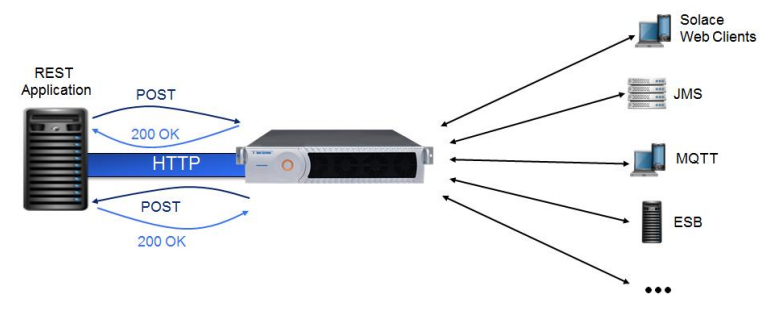

This tutorial will introduce you to the fundamentals of the Solace REST messaging API. The tutorial will show you how to connecting a client, sending a message on a topic subscription and receive this message again through the Solace REST messaging API. This forms the basis for any publish / subscribe message exchange illustrated here:  

## Assumptions

This tutorial assumes the following:

*   You are familiar with Solace [core concepts](https://docs.solace.com/PubSub-Basics/Core-Concepts.htm).
*   You have access to a running Solace message router with the following configuration:
    *   Connectivity information for a Solace message-VPN
    *   Enabled client username and password
    *   Enabled guaranteed messaging support (needed for REST consumers)
    *   Client-profile enabled with guaranteed messaging permissions.

*   REST service enabled for incoming and outgoing messages

One simple way to get access to Solace messaging quickly is to create a messaging service in Solace Cloud [as outlined here](https://solace.com/cloud/). You can find other ways to get access to Solace messaging below.

You can learn all about REST on Solace messaging by referring to the [Online REST Messaging Documentation](https://docs.solace.com/Open-APIs-Protocols/REST-get-start.htm).

## Goals

The goal of this tutorial is to demonstrate the most basic messaging interaction using Solace. This tutorial will show you:

1.  How to send a message on a topic using the Solace REST messaging API
2.  How to receive a message using the Solace REST messaging API

## Solace REST Messaging API Introduction

As outlined in the [Online REST Messaging Documentation](https://docs.solace.com/Open-APIs-Protocols/REST-get-start.htm), the API enable users to send messages to and asynchronously receive messages with Solace messaging over HTTP using a RESTful API.

The Solace API uses HTTP POST requests to allow clients to publish message Solace messaging. On the subscribe side, the Solace API follows the asynchronous notification pattern and uses an HTTP POST from Solace messaging to the client to delivery messages. This means that pub and sub messages are sent on different HTTP connections than they are received as shown in the following figure.



There are several benefits to this approach. First it removes the possibility of message loss which can exist when using HTTP GET requests without explicit separate acknowledgement. It also enables much higher performance and overall message rate when multiple, parallel HTTP connections are used.

The [Online REST Messaging Documentation](https://docs.solace.com/Open-APIs-Protocols/REST-get-start.htm) has the following parts which explain the API in more detail:

* REST Messaging Introduction & REST Messaging Concepts which explains the API at an architectural level.
* REST Messaging Protocol which explains the wireline details - like how to format the HTTP messages etc.

Because of the difference between publishing and subscribing, these topics are introduced as needed in the tutorial below.

`markdown:solaceMessaging-part1.md`

`markdown:solaceMessaging-part2.md`

## Obtaining the Solace API

There is no API to obtain. The Solace REST messaging API is a wireline RESTful HTTP protocol. It is fully outlined in [REST Messaging Protocol](https://docs.solace.com/RESTMessagingPrtl/Solace-REST-Overview.htm).

## Receiving a message

First this tutorial will show how to setup the subscriber side so that you are ready to receive messages that are published.


On the consume side, the Solace REST messaging API depends on a guaranteed messaging queue. As such it is a requirement for REST consumers that Solace messaging support guaranteed messaging and have this feature configured as outlined in the [assumptions section above](#Assumptions).

In order to receive REST messages from Solace messaging, you must configure a Guaranteed messaging queue and a REST delivery point. The queue is used to attract messages to the consumer application. The REST delivery point is the Solace message router component that delivers the messages from the queue to the consumer application asynchronously through HTTP POST requests. This is explained in more detail in the [REST Messaging Concepts](https://docs.solace.com/Open-APIs-Protocols/REST-get-start.htm) where the REST consumers are explained. This tutorial will walk you through the required Solace messaging configuration steps required to create a queue and REST delivery point to connect to your REST consumer application.

### A Simple REST Consumer

First you need a REST consuming application ready to receive HTTP connections from Solace messaging. This can be any HTTP server. This tutorial will demonstrate this using Node.js but Solace REST Messaging uses standard HTTP, so use your favorite HTTP server.

Create a file named NodeRestServer.js with the following contents.

```
var http = require('http');

http.createServer(function (req, res) {
    console.log('Received message: ' + req.url);
    res.writeHead(200);
    res.end();
}).listen(RC_PORT, RC_HOST);
console.log('Server running at http://' + RC_HOST + ':' + RC_PORT + '/');
```

<br/><div style="padding:5px;border:1px solid #AAAAAA;background:lightgray">
<b>Note:</b> The values of RC\_HOST and RC\_PORT need to be updated with the host and port where the REST server is running. It should be noted that this host and port will be updated as REST endpoint host and port in the REST Delivery Point configuration.
</div><br/>

In the above, you need to update RC\_HOST and RC\_PORT to represent the HOST and PORT that your REST consumer application will be listening on. This HTTP server listens for incoming requests and for each request it will print the URL of the request and respond with a 200 OK response. The 200 OK response indicates to Solace messaging that the message has been successfully processed and it can be removed from Solace messaging queue.

Start your REST consumer using Node.js. For example:

```
$ node NodeRestServer.js
Server running at http://<RC_HOST>:<RC_PORT>/
```

**Note:** The executable is `nodejs` on Ubuntu due to a naming conflict with other packages.

Again in your environment, the RC\_HOST and RC\_PORT will be the host/IP and port that your server is listening on. For example http://192.168.1.110:10000/ or with a public DNS name http://myhost.mydomain.com:10000 (for example).

**Note:** Even though this tutorial is illustrating how to publish with direct messages, for REST delivery points, the messages are always consumed from a queue. The incoming messages are promoted into the Solace queue as non-persistent messages and delivered to the REST consumer as non-persistent messages. For more information on this see the [Features – Topic Matching and Message Delivery Modes](https://docs.solace.com/PubSub-Basics/Topic-Matching-and-Delivery-Modes.htm).

### Configuring a REST Delivery Point

Next, you must configure a queue and REST delivery point on Solace messaging. This means configuring the following Solace messaging components.

<table>
<tr>
    <th>Resource</th>
    <th>Value</th>
  </tr>
  <tr>
    <td>Queue</td>
    <td>Q/rdp1/input</td>
  </tr>
  <tr>
    <td>Pub/Sub Topic</td>
    <td>T/rest/pubsub</td>
  </tr>
  <tr>
    <td>REST Delivery Point</td>
    <td>rdp1</td>
  </tr>
  <tr>
    <td>Queue Binding</td>
    <td>Q/rdp1</td>
  </tr>
  <tr>
    <td>POST Request Target</td>
    <td>/rest/tutorials</td>
  </tr>
  <tr>
    <td>REST Consumer</td>
    <td>rc1</td>
  </tr>
  <tr>
    <td>Remote Host</td>
    <td>RC_HOST – Update to match REST consumer application.</td>
  </tr>
  <tr>
    <td>Remote Port</td>
    <td>RC_PORT – Update to match REST consumer application.</td>
  </tr>
</table>

You can learn about each of these components using [Features – REST Introduction](https://docs.solace.com/Open-APIs-Protocols/Using-REST.htm). In the script below, update VPNNAME to match that of your Solace messaging solution, and the RC\_HOST and RC\_PORT to match your REST consumer application.

### Option 1: Using PubSub+ Broker Manager

<div style='background:#E6F4EA;color:#137333;margin:2em 0;padding:0.5em 1em;border-left:4px solid;border-radius:4px'>Applicable to Solace PubSub+ Software & Cloud Brokers</div>

 - Create a Queue object
  
  

  

  

 - Create Queue Subscription object

  

  


 - Create a REST Delivery Point object

  

  

  

 - Create a Queue Binding object
  
  

  

  

  

 - Create a REST Consumer object
  
  

  

  
  
  

<br/>

To know more about PubSub+ Broker Manager check out [PubSub+ Broker Manager overview](https://docs.solace.com/Broker-Manager/PubSub-Manager-Overview.htm).

### Option 2: Using SEMP and Postman

<div style='background:#E6F4EA;color:#137333;margin:2em 0;padding:0.5em 1em;border-left:4px solid;border-radius:4px'>Applicable to Solace PubSub+ Software & Cloud Brokers</div>

Solace Element Management Protocol version 2 (SEMP v2) is a RESTful API that you can use to configure Solace PubSub+ event brokers. It complements Solace's CLI and SolAdmin, and provides a programmable way to configure Solace PubSub+ event brokers.

1. Download SEMP v2 specification


<br/>
   Alternately, you can download from the following URLs:
    
  ```
  http://<SOFTWARE_BROKER_HOST>:8080/SEMP/v2/config/spec
  ```

  *or*
  ```
  https://<CLOUD_BROKER_HOST>:943/SEMP/v2/config/spec
  ```

2. Launch postman and import the JSON file
   
<br/>

3. Note the SEMP v2 URL and access credentials<br/>
   
   For PubSub+ Software Broker - the SEMP requests can be posted to the following URL
    ```
    http://<SOFTWARE_BROKER_HOST>:8080/SEMP/v2/config
    ```
    where the BROKER_HOST is the host name of the Software Broker is running. 

    Make a note of the broker name and client username and password that has **full access** to the broker. 
    <br/>  

    For PubSub+ Cloud Broker - select the Broker Service, select the **Manage** tab and locate the *SEMP - REST API* section. Note the URL to SEMP spec 
    ```
    https://<CLOUD_BROKER_HOST>:943/SEMP/v2/config
    ```
    where the BROKER_HOST is the host name of the Software Broker is running.

    Make a note of the SEMP user credentials listed here.
    <br/>


    

  <br/>
  
4. Execute the following SEMP POST requests to create resources associated with REST Delivery Point. 
   
   Ensue that the REST requests are appropriately updated with user credentials.    


   <br/>

 - Create a Queue object
  
  ```
  URL: 
  https://<CLOUD_BROKER_HOST>:943/SEMP/v2/config/msgVpns/restbroker/queues

  BODY:
  {
    "accessType": "exclusive",
    "egressEnabled": true,
    "ingressEnabled": true,
    "msgVpnName": "restbroker",
    "owner": "all",
    "permission": "delete",
    "queueName": "Q/rdp1/input"
  }
  ```


 - Create Queue Subscription object

<div style="padding:5px;border:1px solid #AAAAAA;background:lightgray">
<b>Note:</b> Since the queue name parameter contains '/' character, you have to select the queue name string in the URL and encode the URI component.

  

  

  

</div><br/>

  ```  
  URL: 
  https://<CLOUD_BROKER_HOST>:943/SEMP/v2/config/msgVpns/restbroker/queues/Q%2Frdp1%2Finput/subscriptions
  BODY:
  {
      "msgVpnName": "restbroker",
      "queueName": "Q/rdp1/input",
      "subscriptionTopic": "T/rest/pubsub"
  }
  ```


 - Create a REST Delivery Point object
  
  ```
  URL: 
  https://CLOUD_BROKER_HOST:943/SEMP/v2/config/msgVpns/restbroker/restDeliveryPoints

  BODY:
  {
      "clientProfileName": "default",
      "enabled": true,
      "msgVpnName": "restbroker",
      "restDeliveryPointName": "rdp1"
  }
  ```

 

 - Create a Queue Binding object
  
  ```
  URL: 
  https://<CLOUD_BROKER_HOST>:943/SEMP/v2/config/msgVpns/restbroker/restDeliveryPoints/rdp1/queueBindings

  BODY:
  {
      "gatewayReplaceTargetAuthorityEnabled": false,
      "msgVpnName": "restbroker",
      "postRequestTarget": "/rest/tutorials",
      "queueBindingName": "Q/rdp1/input",
      "restDeliveryPointName": "rdp1"
  }
  ```


 - Create a REST Consumer object
  
  ```
  URL: 
  https://<CLOUD_BROKER_HOST>:943/SEMP/v2/config/msgVpns/restbroker/restDeliveryPoints/rdp1/restConsumers

  BODY:
  {
      "enabled": true,
      "msgVpnName": "restbroker",
      "remoteHost": "RC_HOST",
      "remotePort": RC_PORT,
      "restConsumerName": "rc1",
      "restDeliveryPointName": "rdp1",
      "tlsEnabled": false
  }
  ```

   

<br/><div style="padding:5px;border:1px solid #AAAAAA;background:lightgray">
<b>Note:</b> It should be noted that Postman tool offers a UI based API invocation to affect changes on the Broker. Non-UI tools like *curl* can also be used to accomplish the same.
</div><br/>


To know more about SEMP check out [SEMP overview](https://docs.solace.com/SEMP/Using-SEMP.htm).
### Option 3: Using SEMP and <code>curl</code>

<div style='background:#E6F4EA;color:#137333;margin:2em 0;padding:0.5em 1em;border-left:4px solid;border-radius:4px'>Applicable to Solace PubSub+ Software & Cloud Brokers</div>

Here is a list of curl commands that can accomplish the REST Delivery Point creation similar to Postman. 

<table>
  <tr>
    <th>
      Create a Queue object
    </th>
  </tr>
  <tr>
    <td>
      <pre>
curl \
  -X POST 'https://mrgt77uxm7c7e.messaging.solace.cloud:943/SEMP/v2/config/msgVpns/restbroker/queues' \
  -d '{
      "accessType": "exclusive",
      "egressEnabled": true,
      "ingressEnabled": true,
      "msgVpnName": "restbroker",
      "owner": "all",
      "permission": "delete",
      "queueName": "Q/rdp1/input"
  }'\
  -H 'Content-Type: application/json' \
  -H 'Solace-delivery-mode: direct'  \
  --user restbroker-admin:p7ea15ri8l7ro6bk03u1pt77on
      </pre>
    </td>
  </tr>
  <tr>
    <th>Create Queue Subscription object</th>
  </tr>
  <tr>
    <td>
      <pre>
curl \
    -X POST 'https://mrgt77uxm7c7e.messaging.solace.cloud:943/SEMP/v2/config/msgVpns/restbroker/queues/Q%2Frdp1%2Finput/subscriptions' \
    -d '{
        "msgVpnName": "restbroker",
        "queueName": "Q/rdp1/input",
        "subscriptionTopic": "T/rest/pubsub"
    }'\
    -H 'Content-Type: application/json' \
    -H 'Solace-delivery-mode: direct'  \
    --user restbroker-admin:p7ea15ri8l7ro6bk03u1pt77on
      </pre>
      <div style="padding:5px;border:1px solid #AAAAAA;background:lightgray">
      <b>Note:</b> Since the queue name parameter contains '/' character, you have to select the queue name string in the URL and encode the URI component.
      </div>
    </td>
  </tr>  
  <tr>
    <th>Create a REST Delivery Point object</th>
  </tr>
  <tr>
    <td>
      <pre>
curl \
    -X POST 'https://mrgt77uxm7c7e.messaging.solace.cloud:943/SEMP/v2/config/msgVpns/restbroker/restDeliveryPoints' \
    -d '{
        "clientProfileName": "default",
        "enabled": true,
        "msgVpnName": "restbroker",
        "restDeliveryPointName": "rdp1"
    }'\
    -H 'Content-Type: application/json' \
    -H 'Solace-delivery-mode: direct'  \
    --user restbroker-admin:p7ea15ri8l7ro6bk03u1pt77on
      </pre>
    </td>
  </tr>  
  <tr>
    <th>Create a Queue Binding object</th>
  </tr>
  <tr>
    <td>
      <pre>
curl \
    -X POST 'https://mrgt77uxm7c7e.messaging.solace.cloud:943/SEMP/v2/config/msgVpns/restbroker/restDeliveryPoints/rdp1/queueBindings' \
    -d '{
        "gatewayReplaceTargetAuthorityEnabled": false,
        "msgVpnName": "restbroker",
        "postRequestTarget": "/rest/tutorials",
        "queueBindingName": "Q/rdp1/input",
        "restDeliveryPointName": "rdp1"
    }' \
    -H 'Content-Type: application/json' \
    -H 'Solace-delivery-mode: direct'  \
    --user restbroker-admin:p7ea15ri8l7ro6bk03u1pt77on
      </pre>
    </td>
  </tr>  
  <tr>
    <th>Create a REST Consumer object</th>
  </tr>
  <tr>
    <td>
      <pre>
curl \
    -X POST 'https://mrgt77uxm7c7e.messaging.solace.cloud:943/SEMP/v2/config/msgVpns/restbroker/restDeliveryPoints/rdp1/restConsumers' \
    -d '{
        "enabled": true,
        "msgVpnName": "restbroker",
        "remoteHost": "RC_HOST",
        "remotePort": RC_PORT,
        "restConsumerName": "rc1",
        "restDeliveryPointName": "rdp1",
        "tlsEnabled": false
    }' \
    -H 'Content-Type: application/json' \
    -H 'Solace-delivery-mode: direct'  \
    --user restbroker-admin:p7ea15ri8l7ro6bk03u1pt77on
      </pre>
    </td>
  </tr>  
</table>

### Option 4: Using Solace CLI

<div style='background:#E6F4EA;color:#137333;margin:2em 0;padding:0.5em 1em;border-left:4px solid;border-radius:4px'>Applicable to Solace PubSub+ Software & Appliance Brokers</div>

The Solace Command Line Interface (CLI) is a text-based interface for configuring and monitoring Solace event brokers. It allows a user to perform event broker administration, configuration and provisioning, and network troubleshooting tasks. The CLI automatically starts after the event broker powers up.

Reference guides to the Solace CLI can be found in these locations: [Appliance CLI Commands](https://docs.solace.com/Solace-CLI/CLI-Reference/APPL_CLI_Commands.html) and [Software Event Broker CLI Commands](https://docs.solace.com/Solace-CLI/CLI-Reference/VMR_CLI_Commands.html).


The following script captures necessary commands in sequence to configure the above mentioned [resources](#Configuring-a-REST-Delivery-Point).

<br/><div style="padding:5px;border:1px solid #AAAAAA;background:lightgray">
<b>Note:</b> Ensure that the values of VPNNAME, RC\_HOST and RC\_PORT are updated with correct values in the following CLI script fragment (Message VPN name, host and port where the REST server is running).
</div><br/>


```
home
enable
configure

message-spool message-vpn "VPNNAME"
    ! pragma:interpreter:ignore-already-exists
    create queue "Q/rdp1/input" primary
        access-type "exclusive"
        permission all "delete"
        subscription topic "T/rest/pubsub"
        no shutdown
        exit
    exit

message-vpn "VPNNAME"
    rest
        ! pragma:interpreter:ignore-already-exists
        create rest-delivery-point "rdp1"
            shutdown
            client-profile "default"
            ! pragma:interpreter:ignore-already-exists
            create queue-binding "Q/rdp1/input"
                post-request-target "/rest/tutorials"
                    exit
            ! pragma:interpreter:ignore-already-exists
            create rest-consumer "rc1"
                shutdown
                remote host "RC_HOST"
                remote port "RC_PORT"
                no shutdown
                exit
            no shutdown
            exit
        exit
    exit
end
```

To apply this configuration, simply log in to Solace messaging CLI as an admin user and paste the above script fragments into the CLI.

```
ssh admin@<HOST>
Solace - Virtual Message Router (VMR)
Password:
```

At this the REST delivery point is configured and should be operational and connected to your REST consumer application. You can verify this using SolAdmin or through the following CLI command.

```
solace(configure)# show message-vpn VPNNAME rest rest-delivery-point *

Total REST Delivery Points (up):                       1
Total REST Delivery Points (configured):               1
Total REST Consumers (up):                             1
Total REST Consumers (configured):                     1
Total REST Consumer Outgoing Connections (up):         3
Total REST Consumer Outgoing Connections (configured): 3
Total Queue Bindings (up):                             1
Total Queue Bindings (configured):                     1

Flags Legend:
A - Admin State (U=Up, D=Down)
O - Oper State (U=Up, D=Down)

                                                  REST
                                                Consumer
                                                Outgoing      Queue       Conns
                                        Status    Conns      Bindings    Blocked

RDP Name             Message VPN         A O    (up/conf)    (up/conf)     (%)
-------------------- ------------------ ------ ----------- ------------- -------
rdp1                 default             U U       3 / 3       1 / 1        0
```

At this point the consumer is up and ready to receive messages.

To know more about Solace CLI check out [Solace CLI overview](https://docs.solace.com/Solace-CLI/Using-Solace-CLI.htm).

We have successfully configured a REST Delivery Point using Solace CLI. Follow the instructions in the next section to send a POST request on the designated POST URL and see that it is delivered to the designated queue, and in turn retrieved on the REST consumer we started here - [A Simple REST Consumer](#A-Simple-REST-Consumer).
## Sending a message

Now it is time to send a message to the waiting consumer.  


Sending a REST message to Solace is very simple. For this example, we will use the command line tool cURL to send the required HTTP. Refer to [REST Messaging Protocol Guide](https://docs.solace.com/RESTMessagingPrtl/Solace-REST-Overview.htm) for the full details of the Solace REST messaging API.

To send a message you can use the following command.

```
$ curl -X POST -d "Hello World REST" http://HOST:PORT/T/rest/pubsub -H "content-type: text" -H "Solace-delivery-mode: direct"
```

You will need to update HOST and PORT to match your Solace messaging HOST and REST service port. This will send a message with contents “Hello World REST” as a Solace text message using the direct delivery mode. The “content-type” headers and “Solace-delivery-mode” are optional. If they are omitted then the Solace REST messaging default delivery mode of “persistent” will be used and the message contents will be treated as binary.

You can also add credentials to the request by updating the cURL command to the following:

```
$ curl -X POST -d "Hello World REST" http://HOST:PORT/T/rest/pubsub -H "content-type: text" -H "Solace-delivery-mode: direct" --user restUsers:restPassword
```

At this point your REST consumer should have received a message. It will print the URL to the screen. So the output should now include:

```
Received message: /rest/tutorials
```

## Summarizing

You have now successfully sent and received a REST message on a topic.

